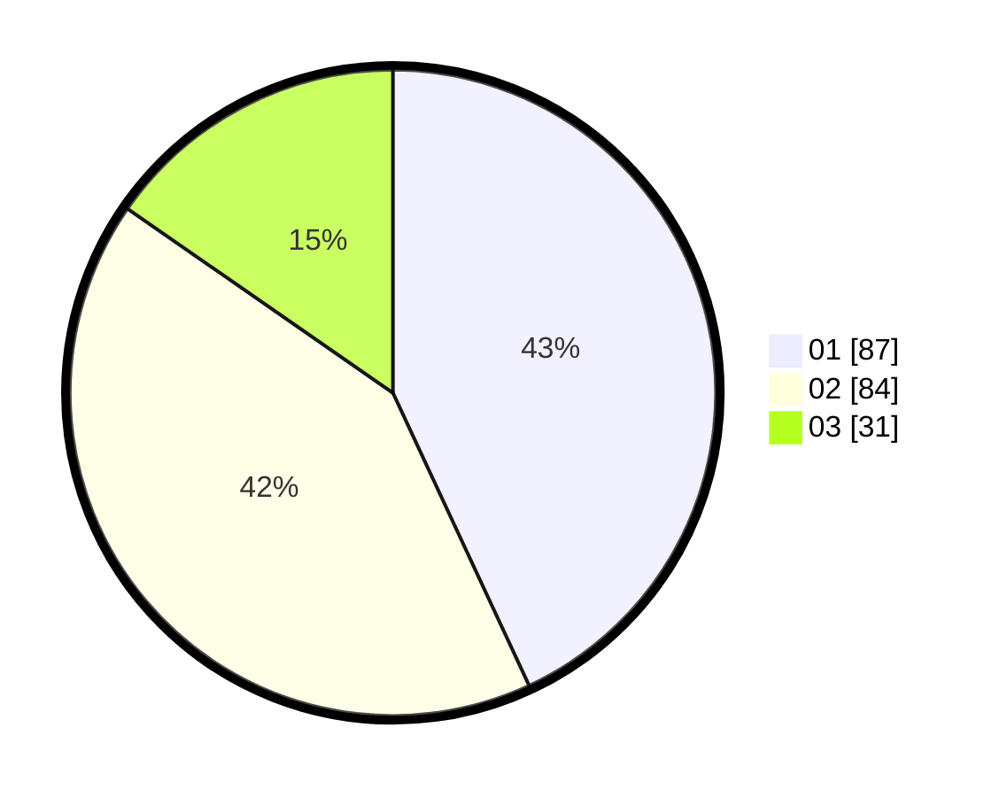

# Hasil

Hasil perolehan suara paslon dapat dilihat pada file paslon-01.txt, paslon-02.txt, dan paslon-03.txt.

Jika tidak ada, artinya data tersebut belum ada pada SIREKAP.

## Perolehan Suara

 * Paslon 01: **87**.
 * Paslon 02: **84**.
 * Paslon 03: **31**.

## Foto C Plano

https://sirekap-obj-formc.kpu.go.id/35b7/pemilu/ppwp/31/71/05/10/03/3171051003025-20240216-085442--52d8a4a9-23d7-4f7d-939f-33173f58fbd5.jpg

https://sirekap-obj-formc.kpu.go.id/35b7/pemilu/ppwp/31/71/05/10/03/3171051003025-20240216-085443--5ba091ee-3d8b-47df-9692-adace9a5e5da.jpg

https://sirekap-obj-formc.kpu.go.id/35b7/pemilu/ppwp/31/71/05/10/03/3171051003025-20240216-085443--5502c878-bb0e-4f5a-b366-d002061186bd.jpg

## DATA PEMILIH TETAP

Jumlah pemilih dalam DPT: **267**.
 * L: **136**.
 * P: **131**.

## DATA PENGGUNA HAK PILIH

Jumlah pengguna hak pilih dalam DPT: **267**.
 * L: **136**.
 * P: **131**.

Jumlah pengguna hak pilih dalam DPTb: **5**.
 * L: **1**.
 * P: **4**.

Jumlah pengguna hak pilih dalam DPK: **0**.
 * L: **0**.
 * P: **0**.

Jumlah pengguna hak pilih: **272**.
 * L: **137**.
 * P: **135**.

## JUMLAH SUARA SAH DAN TIDAK SAH

JUMLAH SELURUH SUARA SAH: **202**.

JUMLAH SUARA TIDAK SAH: **3**.

JUMLAH SELURUH SUARA SAH DAN SUARA TIDAK SAH: **205**.
