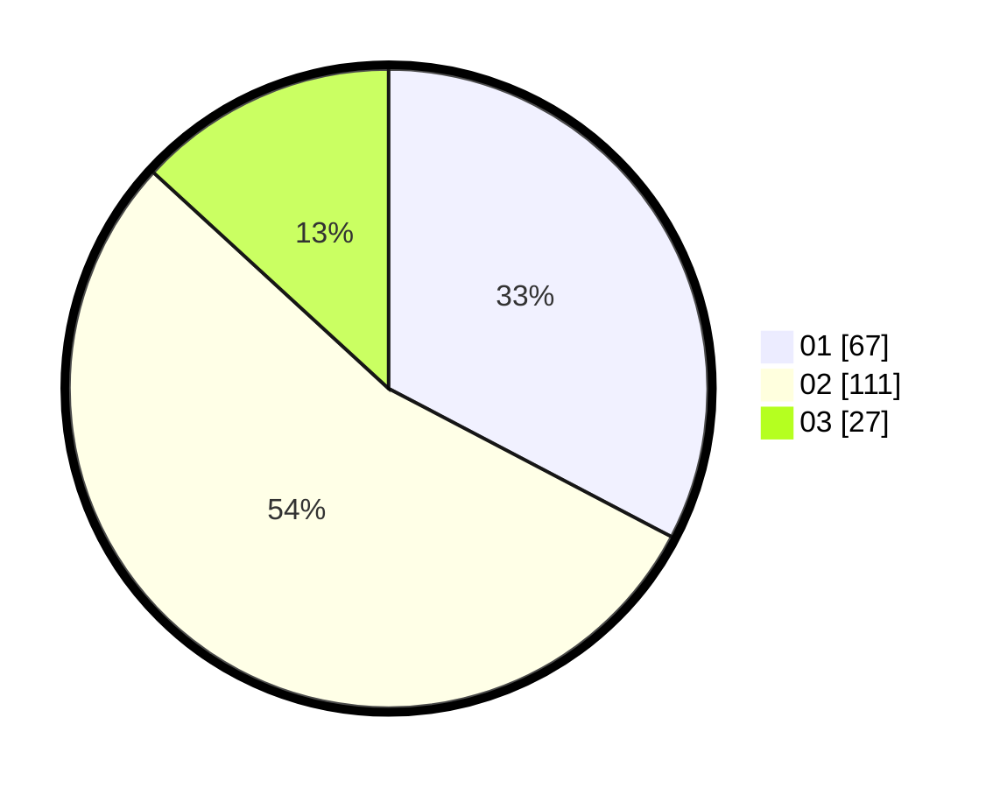

# Hasil

Hasil perolehan suara paslon dapat dilihat pada file paslon-01.txt, paslon-02.txt, dan paslon-03.txt.

Jika tidak ada, artinya data tersebut belum ada pada SIREKAP.

## Perolehan Suara

 * Paslon 01: **67**.
 * Paslon 02: **111**.
 * Paslon 03: **27**.

## Foto C Plano

https://sirekap-obj-formc.kpu.go.id/099d/pemilu/ppwp/31/71/05/10/03/3171051003026-20240215-224022--3e6bf260-921d-4cb3-bde7-c34ad967cc01.jpg

https://sirekap-obj-formc.kpu.go.id/099d/pemilu/ppwp/31/71/05/10/03/3171051003026-20240215-004913--145a2a84-cbc2-445c-93bf-7a8b0fd498ed.jpg

https://sirekap-obj-formc.kpu.go.id/099d/pemilu/ppwp/31/71/05/10/03/3171051003026-20240215-005042--283dc8d2-137c-40eb-b32c-e6b7d5e1a024.jpg

## DATA PEMILIH TETAP

Jumlah pemilih dalam DPT: **280**.
 * L: **137**.
 * P: **143**.

## DATA PENGGUNA HAK PILIH

Jumlah pengguna hak pilih dalam DPT: **210**.
 * L: **102**.
 * P: **108**.

Jumlah pengguna hak pilih dalam DPTb: **3**.
 * L: **1**.
 * P: **2**.

Jumlah pengguna hak pilih dalam DPK: **1**.
 * L: **0**.
 * P: **1**.

Jumlah pengguna hak pilih: **214**.
 * L: **103**.
 * P: **111**.

## JUMLAH SUARA SAH DAN TIDAK SAH

JUMLAH SELURUH SUARA SAH: **205**.

JUMLAH SUARA TIDAK SAH: **9**.

JUMLAH SELURUH SUARA SAH DAN SUARA TIDAK SAH: **214**.
