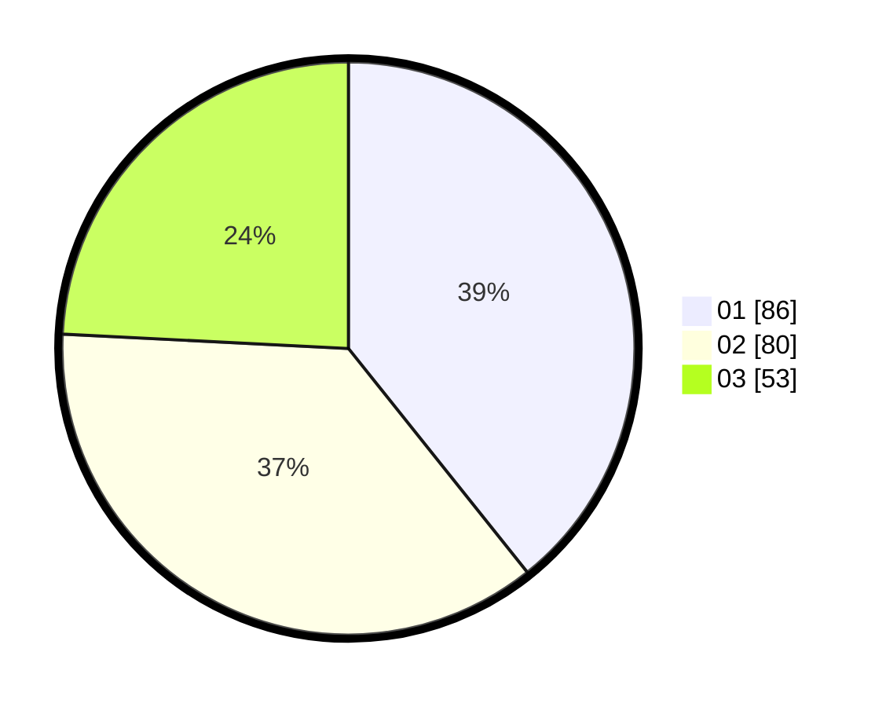

# Hasil

Hasil perolehan suara paslon dapat dilihat pada file paslon-01.txt, paslon-02.txt, dan paslon-03.txt.

Jika tidak ada, artinya data tersebut belum ada pada SIREKAP.

## Perolehan Suara

 * Paslon 01: **86**.
 * Paslon 02: **80**.
 * Paslon 03: **53**.

## Foto C Plano

https://sirekap-obj-formc.kpu.go.id/675f/pemilu/ppwp/31/71/05/10/03/3171051003027-20240216-031326--f40b908b-18de-424b-b472-1f5bcfc284f9.jpg

https://sirekap-obj-formc.kpu.go.id/675f/pemilu/ppwp/31/71/05/10/03/3171051003027-20240216-032401--2d73bda6-b8b3-48e4-a602-4911a83b1d47.jpg

https://sirekap-obj-formc.kpu.go.id/675f/pemilu/ppwp/31/71/05/10/03/3171051003027-20240216-032358--6f854173-59a8-42b4-9656-419fb08d751b.jpg

## DATA PEMILIH TETAP

Jumlah pemilih dalam DPT: **280**.
 * L: **125**.
 * P: **155**.

## DATA PENGGUNA HAK PILIH

Jumlah pengguna hak pilih dalam DPT: **213**.
 * L: **90**.
 * P: **123**.

Jumlah pengguna hak pilih dalam DPTb: **10**.
 * L: **2**.
 * P: **8**.

Jumlah pengguna hak pilih dalam DPK: **0**.
 * L: **0**.
 * P: **0**.

Jumlah pengguna hak pilih: **223**.
 * L: **92**.
 * P: **131**.

## JUMLAH SUARA SAH DAN TIDAK SAH

JUMLAH SELURUH SUARA SAH: **219**.

JUMLAH SUARA TIDAK SAH: **4**.

JUMLAH SELURUH SUARA SAH DAN SUARA TIDAK SAH: **223**.
