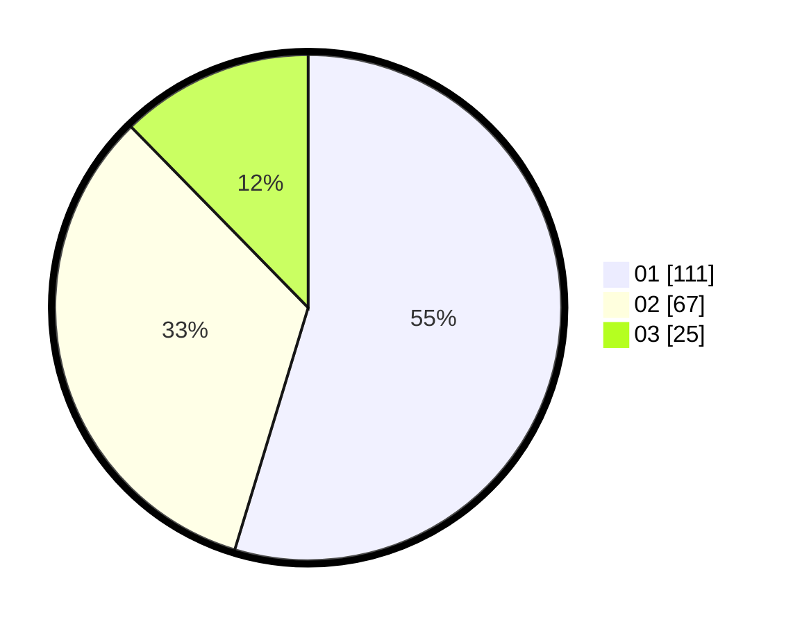

# Hasil

Hasil perolehan suara paslon dapat dilihat pada file paslon-01.txt, paslon-02.txt, dan paslon-03.txt.

Jika tidak ada, artinya data tersebut belum ada pada SIREKAP.

## Perolehan Suara

 * Paslon 01: **111**.
 * Paslon 02: **67**.
 * Paslon 03: **25**.

## Foto C Plano

https://sirekap-obj-formc.kpu.go.id/a9b3/pemilu/ppwp/31/71/05/10/03/3171051003030-20240216-135052--3da2c3ff-ceff-4d79-8056-bcd359b350e5.jpg

https://sirekap-obj-formc.kpu.go.id/a9b3/pemilu/ppwp/31/71/05/10/03/3171051003030-20240216-135053--b1d96b6a-c55d-4bf2-a7a3-064ae82e56ba.jpg

https://sirekap-obj-formc.kpu.go.id/a9b3/pemilu/ppwp/31/71/05/10/03/3171051003030-20240216-135053--6f5104c1-a7b5-412a-8047-a13eacf0c476.jpg

## DATA PEMILIH TETAP

Jumlah pemilih dalam DPT: **275**.
 * L: **136**.
 * P: **139**.

## DATA PENGGUNA HAK PILIH

Jumlah pengguna hak pilih dalam DPT: **195**.
 * L: **101**.
 * P: **94**.

Jumlah pengguna hak pilih dalam DPTb: **6**.
 * L: **2**.
 * P: **4**.

Jumlah pengguna hak pilih dalam DPK: **2**.
 * L: **1**.
 * P: **1**.

Jumlah pengguna hak pilih: **203**.
 * L: **104**.
 * P: **99**.

## JUMLAH SUARA SAH DAN TIDAK SAH

JUMLAH SELURUH SUARA SAH: **203**.

JUMLAH SUARA TIDAK SAH: **1**.

JUMLAH SELURUH SUARA SAH DAN SUARA TIDAK SAH: **204**.
