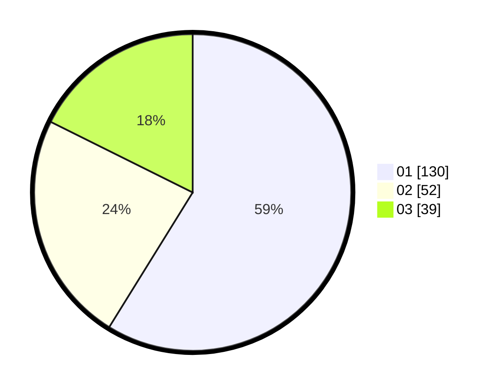

# Hasil

Hasil perolehan suara paslon dapat dilihat pada file paslon-01.txt, paslon-02.txt, dan paslon-03.txt.

Jika tidak ada, artinya data tersebut belum ada pada SIREKAP.

## Perolehan Suara

 * Paslon 01: **130**.
 * Paslon 02: **52**.
 * Paslon 03: **39**.

## Foto C Plano

https://sirekap-obj-formc.kpu.go.id/573f/pemilu/ppwp/31/71/05/10/03/3171051003032-20240216-150035--d0594186-4849-48aa-9489-e0735603185e.jpg

https://sirekap-obj-formc.kpu.go.id/573f/pemilu/ppwp/31/71/05/10/03/3171051003032-20240216-150036--11d657a9-8cc5-4276-ac4b-e7950203482c.jpg

https://sirekap-obj-formc.kpu.go.id/573f/pemilu/ppwp/31/71/05/10/03/3171051003032-20240216-150035--9a522789-4717-4e10-b287-313d8a5994c5.jpg

## DATA PEMILIH TETAP

Jumlah pemilih dalam DPT: **271**.
 * L: **137**.
 * P: **134**.

## DATA PENGGUNA HAK PILIH

Jumlah pengguna hak pilih dalam DPT: **216**.
 * L: **104**.
 * P: **112**.

Jumlah pengguna hak pilih dalam DPTb: **5**.
 * L: **4**.
 * P: **1**.

Jumlah pengguna hak pilih dalam DPK: **2**.
 * L: **1**.
 * P: **1**.

Jumlah pengguna hak pilih: **223**.
 * L: **109**.
 * P: **114**.

## JUMLAH SUARA SAH DAN TIDAK SAH

JUMLAH SELURUH SUARA SAH: **221**.

JUMLAH SUARA TIDAK SAH: **2**.

JUMLAH SELURUH SUARA SAH DAN SUARA TIDAK SAH: **223**.
