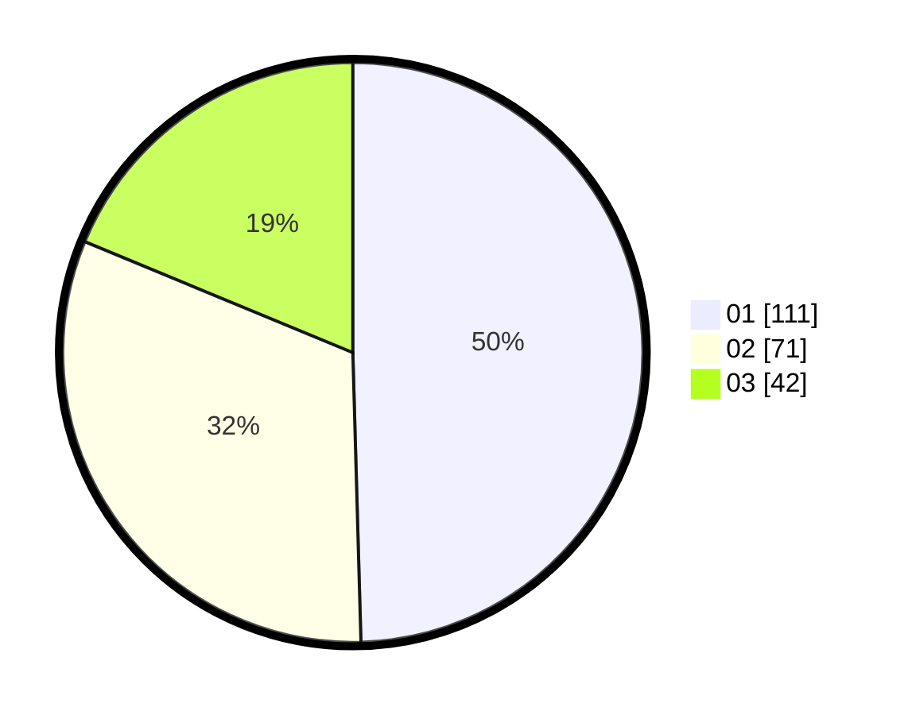

# Hasil

Hasil perolehan suara paslon dapat dilihat pada file paslon-01.txt, paslon-02.txt, dan paslon-03.txt.

Jika tidak ada, artinya data tersebut belum ada pada SIREKAP.

## Perolehan Suara

 * Paslon 01: **111**.
 * Paslon 02: **71**.
 * Paslon 03: **42**.

## Foto C Plano

https://sirekap-obj-formc.kpu.go.id/9238/pemilu/ppwp/31/71/05/10/03/3171051003033-20240214-185644--c16e04ce-9285-496e-b73c-e95d25c345d5.jpg

https://sirekap-obj-formc.kpu.go.id/9238/pemilu/ppwp/31/71/05/10/03/3171051003033-20240214-184631--19c18d93-ada4-40ff-91d9-736cb9d8c798.jpg

https://sirekap-obj-formc.kpu.go.id/9238/pemilu/ppwp/31/71/05/10/03/3171051003033-20240214-185112--88438f0a-4fa8-411d-a42d-6908cead1f87.jpg
