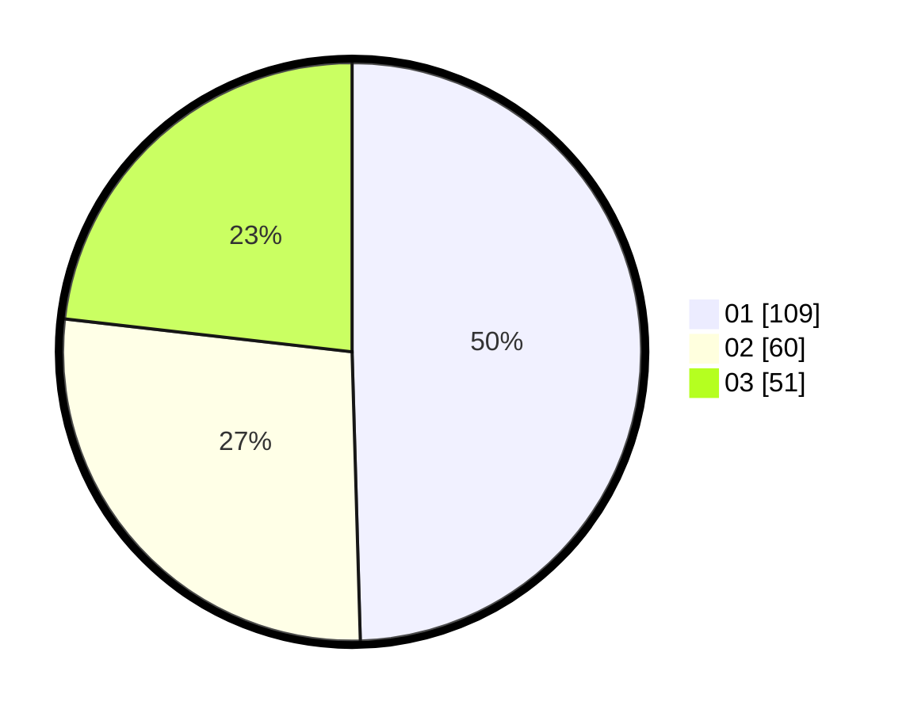

# Hasil

Hasil perolehan suara paslon dapat dilihat pada file paslon-01.txt, paslon-02.txt, dan paslon-03.txt.

Jika tidak ada, artinya data tersebut belum ada pada SIREKAP.

## Perolehan Suara

 * Paslon 01: **109**.
 * Paslon 02: **60**.
 * Paslon 03: **51**.

## Foto C Plano

https://sirekap-obj-formc.kpu.go.id/e074/pemilu/ppwp/31/71/05/10/03/3171051003034-20240215-234413--b6a3f9b0-f136-44b4-9501-808c118f58af.jpg

https://sirekap-obj-formc.kpu.go.id/e074/pemilu/ppwp/31/71/05/10/03/3171051003034-20240215-234415--338508c2-63d7-409f-8be5-4f7cf178a941.jpg

https://sirekap-obj-formc.kpu.go.id/e074/pemilu/ppwp/31/71/05/10/03/3171051003034-20240215-234414--52ee220a-6e86-4af8-ba18-7f9e17176db4.jpg

## DATA PEMILIH TETAP

Jumlah pemilih dalam DPT: **275**.
 * L: **143**.
 * P: **132**.

## DATA PENGGUNA HAK PILIH

Jumlah pengguna hak pilih dalam DPT: **207**.
 * L: **107**.
 * P: **100**.

Jumlah pengguna hak pilih dalam DPTb: **13**.
 * L: **5**.
 * P: **8**.

Jumlah pengguna hak pilih dalam DPK: **2**.
 * L: **1**.
 * P: **1**.

Jumlah pengguna hak pilih: **222**.
 * L: **113**.
 * P: **109**.

## JUMLAH SUARA SAH DAN TIDAK SAH

JUMLAH SELURUH SUARA SAH: **220**.

JUMLAH SUARA TIDAK SAH: **2**.

JUMLAH SELURUH SUARA SAH DAN SUARA TIDAK SAH: **222**.
