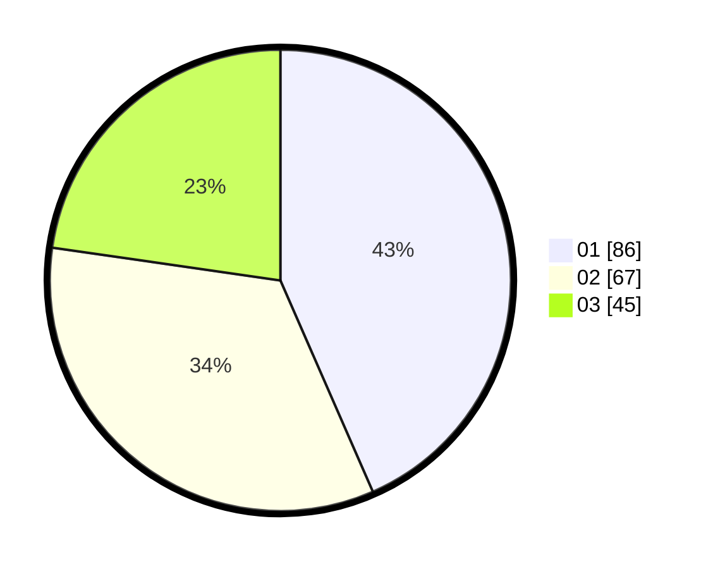

# Hasil

Hasil perolehan suara paslon dapat dilihat pada file paslon-01.txt, paslon-02.txt, dan paslon-03.txt.

Jika tidak ada, artinya data tersebut belum ada pada SIREKAP.

## Perolehan Suara

 * Paslon 01: **86**.
 * Paslon 02: **67**.
 * Paslon 03: **45**.

## Foto C Plano

https://sirekap-obj-formc.kpu.go.id/c360/pemilu/ppwp/31/71/05/10/03/3171051003036-20240215-020454--30ab265a-2bf7-4e6f-ac67-828f97325398.jpg

https://sirekap-obj-formc.kpu.go.id/c360/pemilu/ppwp/31/71/05/10/03/3171051003036-20240216-150322--8d6a44e9-c996-477e-a30f-666a8601dbd9.jpg

https://sirekap-obj-formc.kpu.go.id/c360/pemilu/ppwp/31/71/05/10/03/3171051003036-20240216-150321--90bd71f3-a431-4bce-aeb3-eb66cdc62845.jpg

## DATA PEMILIH TETAP

Jumlah pemilih dalam DPT: **281**.
 * L: **129**.
 * P: **152**.

## DATA PENGGUNA HAK PILIH

Jumlah pengguna hak pilih dalam DPT: **190**.
 * L: **88**.
 * P: **102**.

Jumlah pengguna hak pilih dalam DPTb: **5**.
 * L: **3**.
 * P: **2**.

Jumlah pengguna hak pilih dalam DPK: **4**.
 * L: **2**.
 * P: **2**.

Jumlah pengguna hak pilih: **199**.
 * L: **93**.
 * P: **106**.

## JUMLAH SUARA SAH DAN TIDAK SAH

JUMLAH SELURUH SUARA SAH: **198**.

JUMLAH SUARA TIDAK SAH: **1**.

JUMLAH SELURUH SUARA SAH DAN SUARA TIDAK SAH: **199**.
