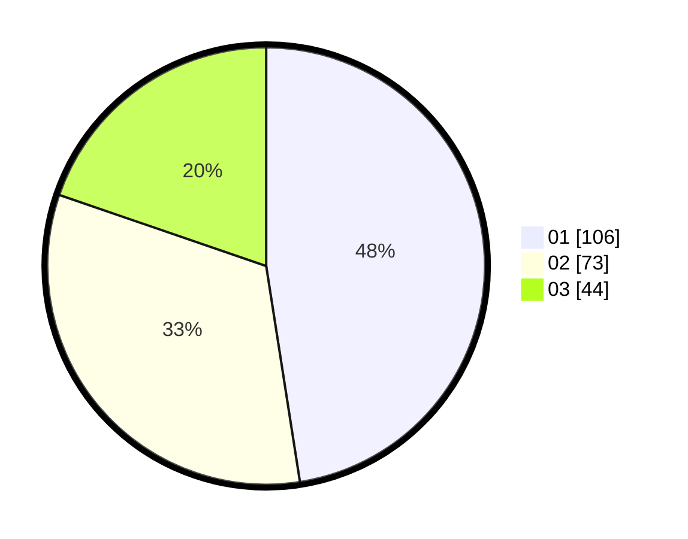

# Hasil

Hasil perolehan suara paslon dapat dilihat pada file paslon-01.txt, paslon-02.txt, dan paslon-03.txt.

Jika tidak ada, artinya data tersebut belum ada pada SIREKAP.

## Perolehan Suara

 * Paslon 01: **106**.
 * Paslon 02: **73**.
 * Paslon 03: **44**.

## Foto C Plano

https://sirekap-obj-formc.kpu.go.id/9b49/pemilu/ppwp/31/71/05/10/03/3171051003038-20240215-231131--6a055ecb-e872-4a8d-836f-a18eb970923c.jpg

https://sirekap-obj-formc.kpu.go.id/9b49/pemilu/ppwp/31/71/05/10/03/3171051003038-20240215-231134--805b1680-be1e-46dc-8b51-e43bb1979d3d.jpg

https://sirekap-obj-formc.kpu.go.id/9b49/pemilu/ppwp/31/71/05/10/03/3171051003038-20240215-231133--ff1fdbef-7084-4eac-adaf-4a54b7204970.jpg

## DATA PEMILIH TETAP

Jumlah pemilih dalam DPT: **277**.
 * L: **134**.
 * P: **143**.

## DATA PENGGUNA HAK PILIH

Jumlah pengguna hak pilih dalam DPT: **221**.
 * L: **106**.
 * P: **115**.

Jumlah pengguna hak pilih dalam DPTb: **5**.
 * L: **3**.
 * P: **2**.

Jumlah pengguna hak pilih dalam DPK: **2**.
 * L: **0**.
 * P: **2**.

Jumlah pengguna hak pilih: **228**.
 * L: **109**.
 * P: **119**.

## JUMLAH SUARA SAH DAN TIDAK SAH

JUMLAH SELURUH SUARA SAH: **223**.

JUMLAH SUARA TIDAK SAH: **5**.

JUMLAH SELURUH SUARA SAH DAN SUARA TIDAK SAH: **228**.
