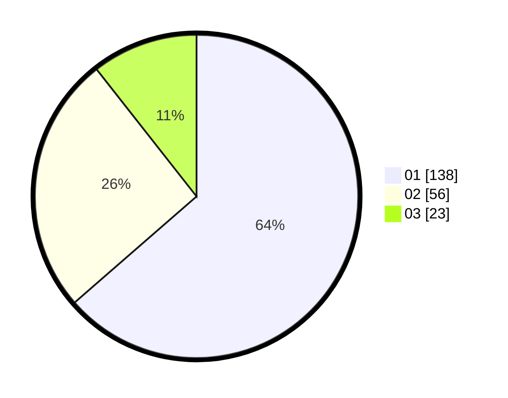

# Hasil

Hasil perolehan suara paslon dapat dilihat pada file paslon-01.txt, paslon-02.txt, dan paslon-03.txt.

Jika tidak ada, artinya data tersebut belum ada pada SIREKAP.

## Perolehan Suara

 * Paslon 01: **138**.
 * Paslon 02: **56**.
 * Paslon 03: **23**.

## Foto C Plano

https://sirekap-obj-formc.kpu.go.id/9fbe/pemilu/ppwp/31/71/05/10/03/3171051003040-20240216-073652--b31036ec-68f1-4eb0-83b9-c5f369c89d79.jpg

https://sirekap-obj-formc.kpu.go.id/9fbe/pemilu/ppwp/31/71/05/10/03/3171051003040-20240216-073653--ddbe5e79-b2a3-4271-a2cb-59911ad89240.jpg

https://sirekap-obj-formc.kpu.go.id/9fbe/pemilu/ppwp/31/71/05/10/03/3171051003040-20240216-073653--2369125b-ef5d-45a0-9ca4-c7ba434e431c.jpg

## DATA PEMILIH TETAP

Jumlah pemilih dalam DPT: **280**.
 * L: **142**.
 * P: **138**.

## DATA PENGGUNA HAK PILIH

Jumlah pengguna hak pilih dalam DPT: **216**.
 * L: **105**.
 * P: **111**.

Jumlah pengguna hak pilih dalam DPTb: **2**.
 * L: **1**.
 * P: **1**.

Jumlah pengguna hak pilih dalam DPK: **1**.
 * L: **1**.
 * P: **0**.

Jumlah pengguna hak pilih: **219**.
 * L: **107**.
 * P: **112**.

## JUMLAH SUARA SAH DAN TIDAK SAH

JUMLAH SELURUH SUARA SAH: **217**.

JUMLAH SUARA TIDAK SAH: **2**.

JUMLAH SELURUH SUARA SAH DAN SUARA TIDAK SAH: **219**.
