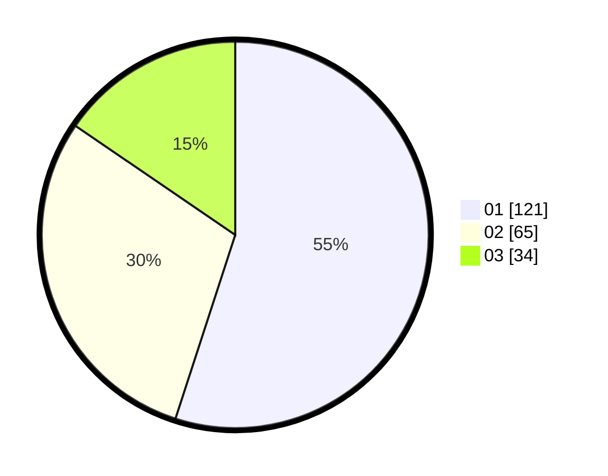

# Hasil

Hasil perolehan suara paslon dapat dilihat pada file paslon-01.txt, paslon-02.txt, dan paslon-03.txt.

Jika tidak ada, artinya data tersebut belum ada pada SIREKAP.

## Perolehan Suara

 * Paslon 01: **121**.
 * Paslon 02: **65**.
 * Paslon 03: **34**.

## Foto C Plano

https://sirekap-obj-formc.kpu.go.id/f2d2/pemilu/ppwp/31/71/05/10/03/3171051003046-20240216-084544--1b0cfa5c-2690-4033-98f0-8d4d42d8df49.jpg

https://sirekap-obj-formc.kpu.go.id/f2d2/pemilu/ppwp/31/71/05/10/03/3171051003046-20240216-084545--fa04f5c1-817b-49d1-b8e9-4ec0aa040868.jpg

https://sirekap-obj-formc.kpu.go.id/f2d2/pemilu/ppwp/31/71/05/10/03/3171051003046-20240216-084544--43d9c71c-f761-40da-ad31-31b2f0c91455.jpg

## DATA PEMILIH TETAP

Jumlah pemilih dalam DPT: **284**.
 * L: **141**.
 * P: **143**.

## DATA PENGGUNA HAK PILIH

Jumlah pengguna hak pilih dalam DPT: **220**.
 * L: **107**.
 * P: **113**.

Jumlah pengguna hak pilih dalam DPTb: **0**.
 * L: **0**.
 * P: **0**.

Jumlah pengguna hak pilih dalam DPK: **2**.
 * L: **0**.
 * P: **2**.

Jumlah pengguna hak pilih: **222**.
 * L: **107**.
 * P: **115**.

## JUMLAH SUARA SAH DAN TIDAK SAH

JUMLAH SELURUH SUARA SAH: **220**.

JUMLAH SUARA TIDAK SAH: **2**.

JUMLAH SELURUH SUARA SAH DAN SUARA TIDAK SAH: **222**.
