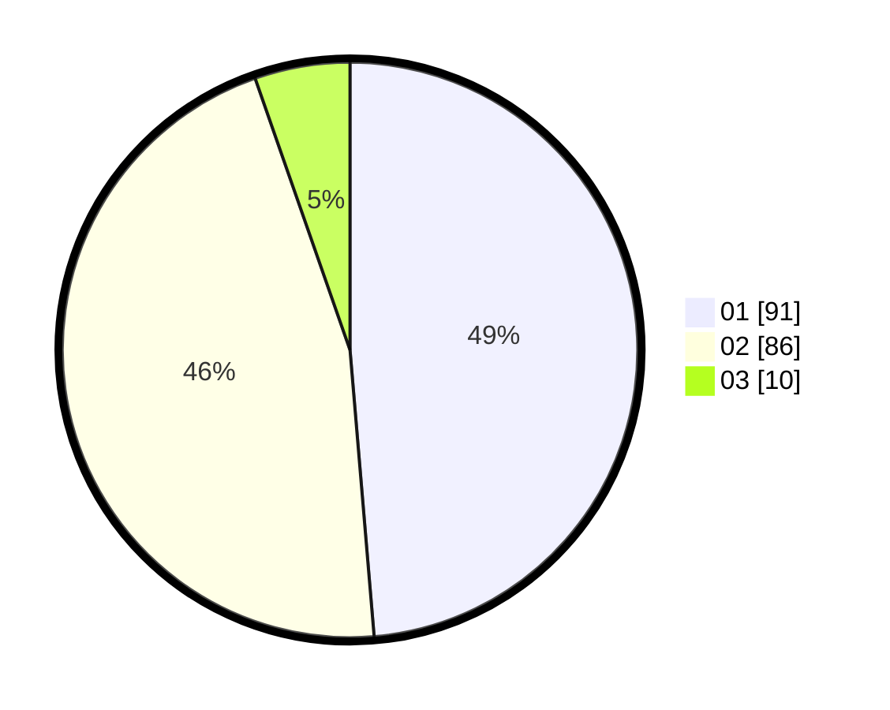

# Hasil

Hasil perolehan suara paslon dapat dilihat pada file paslon-01.txt, paslon-02.txt, dan paslon-03.txt.

Jika tidak ada, artinya data tersebut belum ada pada SIREKAP.

## Perolehan Suara

 * Paslon 01: **91**.
 * Paslon 02: **86**.
 * Paslon 03: **10**.

## Foto C Plano

https://sirekap-obj-formc.kpu.go.id/cb6a/pemilu/ppwp/31/71/05/10/03/3171051003053-20240216-052331--22410892-11fd-4834-8929-143eb8546448.jpg

https://sirekap-obj-formc.kpu.go.id/cb6a/pemilu/ppwp/31/71/05/10/03/3171051003053-20240216-052333--35d0c68e-3541-4af3-9358-91270b60394a.jpg

https://sirekap-obj-formc.kpu.go.id/cb6a/pemilu/ppwp/31/71/05/10/03/3171051003053-20240216-052332--89e69736-e68d-4414-b3cd-6a1f29127090.jpg

## DATA PEMILIH TETAP

Jumlah pemilih dalam DPT: **279**.
 * L: **146**.
 * P: **133**.

## DATA PENGGUNA HAK PILIH

Jumlah pengguna hak pilih dalam DPT: **184**.
 * L: **91**.
 * P: **93**.

Jumlah pengguna hak pilih dalam DPTb: **2**.
 * L: **0**.
 * P: **2**.

Jumlah pengguna hak pilih dalam DPK: **1**.
 * L: **0**.
 * P: **1**.

Jumlah pengguna hak pilih: **187**.
 * L: **91**.
 * P: **96**.

## JUMLAH SUARA SAH DAN TIDAK SAH

JUMLAH SELURUH SUARA SAH: **187**.

JUMLAH SUARA TIDAK SAH: **0**.

JUMLAH SELURUH SUARA SAH DAN SUARA TIDAK SAH: **187**.
