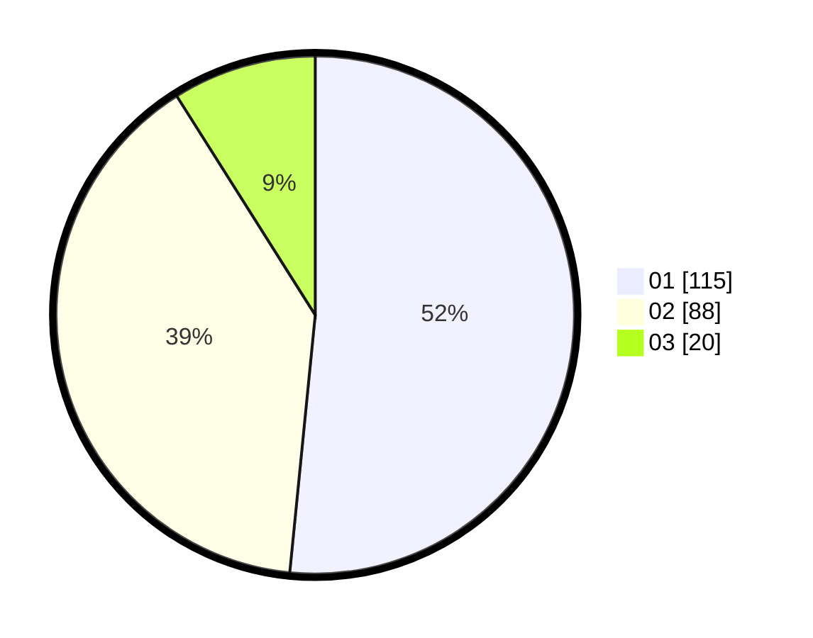

# Hasil

Hasil perolehan suara paslon dapat dilihat pada file paslon-01.txt, paslon-02.txt, dan paslon-03.txt.

Jika tidak ada, artinya data tersebut belum ada pada SIREKAP.

## Perolehan Suara

 * Paslon 01: **115**.
 * Paslon 02: **88**.
 * Paslon 03: **20**.

## Foto C Plano

https://sirekap-obj-formc.kpu.go.id/33ab/pemilu/ppwp/31/71/05/10/03/3171051003054-20240214-155034--2bf8235d-9012-4f42-89d5-2fcfc6d549a2.jpg

https://sirekap-obj-formc.kpu.go.id/33ab/pemilu/ppwp/31/71/05/10/03/3171051003054-20240214-155038--b68d3bec-3a5a-4104-bc04-4739faae6f99.jpg

https://sirekap-obj-formc.kpu.go.id/33ab/pemilu/ppwp/31/71/05/10/03/3171051003054-20240214-155040--33144b1b-34f2-4fc9-b7bf-3b6e37d0745f.jpg

## DATA PEMILIH TETAP

Jumlah pemilih dalam DPT: **287**.
 * L: **147**.
 * P: **140**.

## DATA PENGGUNA HAK PILIH

Jumlah pengguna hak pilih dalam DPT: **219**.
 * L: **111**.
 * P: **108**.

Jumlah pengguna hak pilih dalam DPTb: **2**.
 * L: **0**.
 * P: **2**.

Jumlah pengguna hak pilih dalam DPK: **5**.
 * L: **3**.
 * P: **2**.

Jumlah pengguna hak pilih: **226**.
 * L: **114**.
 * P: **112**.

## JUMLAH SUARA SAH DAN TIDAK SAH

JUMLAH SELURUH SUARA SAH: **223**.

JUMLAH SUARA TIDAK SAH: **3**.

JUMLAH SELURUH SUARA SAH DAN SUARA TIDAK SAH: **226**.
