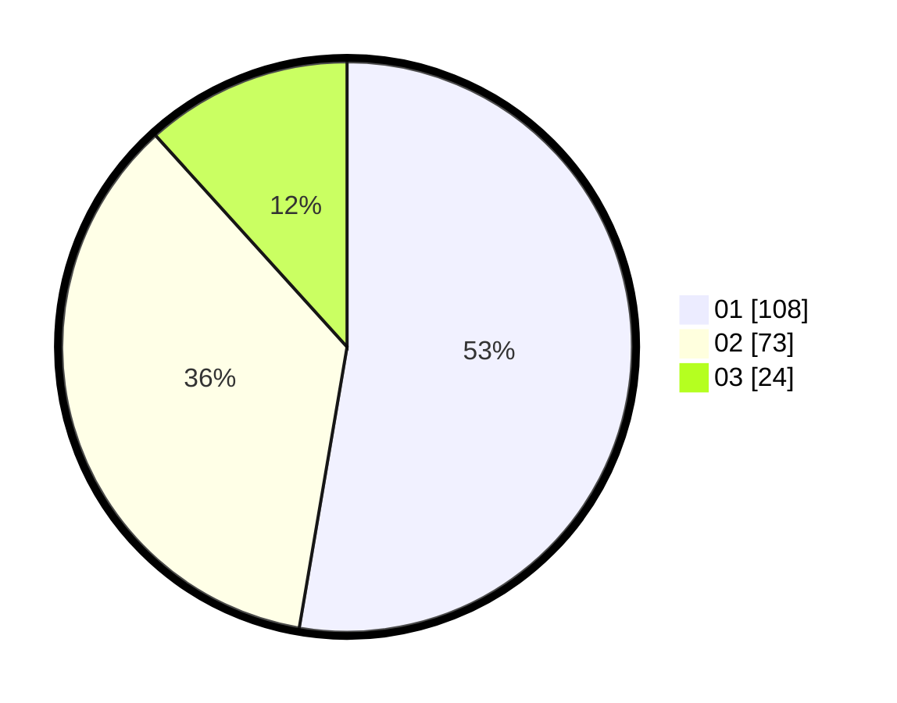

# Hasil

Hasil perolehan suara paslon dapat dilihat pada file paslon-01.txt, paslon-02.txt, dan paslon-03.txt.

Jika tidak ada, artinya data tersebut belum ada pada SIREKAP.

## Perolehan Suara

 * Paslon 01: **108**.
 * Paslon 02: **73**.
 * Paslon 03: **24**.

## Foto C Plano

https://sirekap-obj-formc.kpu.go.id/7a1d/pemilu/ppwp/31/71/05/10/03/3171051003056-20240215-005449--1d9affdd-11a0-4268-90c0-02d28568d297.jpg

https://sirekap-obj-formc.kpu.go.id/7a1d/pemilu/ppwp/31/71/05/10/03/3171051003056-20240215-005706--31e62a13-9c93-4d7b-acb2-78baf4f6893d.jpg

https://sirekap-obj-formc.kpu.go.id/7a1d/pemilu/ppwp/31/71/05/10/03/3171051003056-20240215-005833--ed45c1b2-24b3-41da-889f-b1411e18136d.jpg

## DATA PEMILIH TETAP

Jumlah pemilih dalam DPT: **269**.
 * L: **124**.
 * P: **145**.

## DATA PENGGUNA HAK PILIH

Jumlah pengguna hak pilih dalam DPT: **199**.
 * L: **89**.
 * P: **111**.

Jumlah pengguna hak pilih dalam DPTb: **2**.
 * L: **1**.
 * P: **1**.

Jumlah pengguna hak pilih dalam DPK: **5**.
 * L: **4**.
 * P: **1**.

Jumlah pengguna hak pilih: **207**.
 * L: **94**.
 * P: **113**.

## JUMLAH SUARA SAH DAN TIDAK SAH

JUMLAH SELURUH SUARA SAH: **205**.

JUMLAH SUARA TIDAK SAH: **3**.

JUMLAH SELURUH SUARA SAH DAN SUARA TIDAK SAH: **208**.
