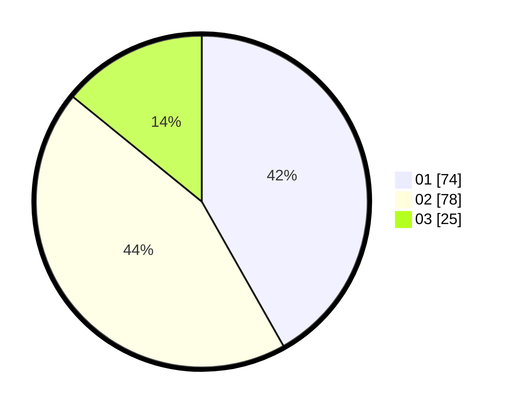

# Hasil

Hasil perolehan suara paslon dapat dilihat pada file paslon-01.txt, paslon-02.txt, dan paslon-03.txt.

Jika tidak ada, artinya data tersebut belum ada pada SIREKAP.

## Perolehan Suara

 * Paslon 01: **74**.
 * Paslon 02: **78**.
 * Paslon 03: **25**.

## Foto C Plano

https://sirekap-obj-formc.kpu.go.id/58ab/pemilu/ppwp/31/71/05/10/03/3171051003057-20240216-012429--257a2565-aa69-40e9-9a98-aaf584fbeb1f.jpg

https://sirekap-obj-formc.kpu.go.id/58ab/pemilu/ppwp/31/71/05/10/03/3171051003057-20240216-012430--79591009-6aff-4431-bc0a-6026c5b3c603.jpg

https://sirekap-obj-formc.kpu.go.id/58ab/pemilu/ppwp/31/71/05/10/03/3171051003057-20240216-012430--5a423d42-0b59-41ac-9a45-2e7802396e68.jpg

## DATA PEMILIH TETAP

Jumlah pemilih dalam DPT: **260**.
 * L: **117**.
 * P: **143**.

## DATA PENGGUNA HAK PILIH

Jumlah pengguna hak pilih dalam DPT: **177**.
 * L: **73**.
 * P: **104**.

Jumlah pengguna hak pilih dalam DPTb: **1**.
 * L: **0**.
 * P: **1**.

Jumlah pengguna hak pilih dalam DPK: **2**.
 * L: **1**.
 * P: **1**.

Jumlah pengguna hak pilih: **180**.
 * L: **74**.
 * P: **106**.

## JUMLAH SUARA SAH DAN TIDAK SAH

JUMLAH SELURUH SUARA SAH: **177**.

JUMLAH SUARA TIDAK SAH: **3**.

JUMLAH SELURUH SUARA SAH DAN SUARA TIDAK SAH: **180**.
