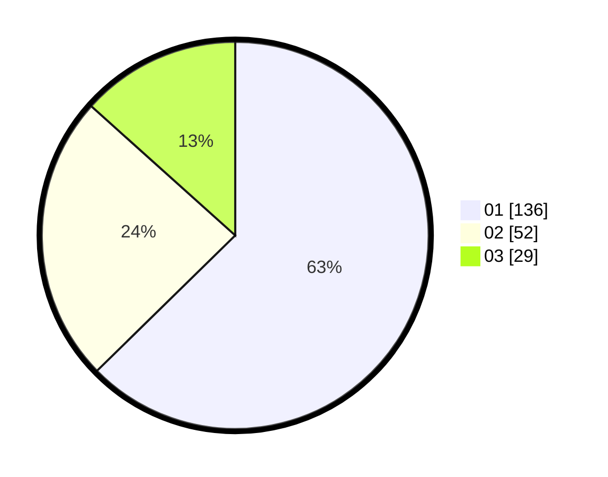

# Hasil

Hasil perolehan suara paslon dapat dilihat pada file paslon-01.txt, paslon-02.txt, dan paslon-03.txt.

Jika tidak ada, artinya data tersebut belum ada pada SIREKAP.

## Perolehan Suara

 * Paslon 01: **136**.
 * Paslon 02: **52**.
 * Paslon 03: **29**.

## Foto C Plano

https://sirekap-obj-formc.kpu.go.id/e70b/pemilu/ppwp/31/71/05/10/03/3171051003058-20240214-220251--48876371-e8fb-4af4-94c8-44df187daabe.jpg

https://sirekap-obj-formc.kpu.go.id/e70b/pemilu/ppwp/31/71/05/10/03/3171051003058-20240214-195308--8dbbf316-daef-4bb6-b608-cbe2d87b2989.jpg

https://sirekap-obj-formc.kpu.go.id/e70b/pemilu/ppwp/31/71/05/10/03/3171051003058-20240214-195419--49ca4c92-d48f-4062-aa20-c944d47e1f56.jpg

## DATA PEMILIH TETAP

Jumlah pemilih dalam DPT: **286**.
 * L: **137**.
 * P: **149**.

## DATA PENGGUNA HAK PILIH

Jumlah pengguna hak pilih dalam DPT: **209**.
 * L: **95**.
 * P: **114**.

Jumlah pengguna hak pilih dalam DPTb: **8**.
 * L: **2**.
 * P: **6**.

Jumlah pengguna hak pilih dalam DPK: **3**.
 * L: **1**.
 * P: **2**.

Jumlah pengguna hak pilih: **220**.
 * L: **98**.
 * P: **122**.

## JUMLAH SUARA SAH DAN TIDAK SAH

JUMLAH SELURUH SUARA SAH: **217**.

JUMLAH SUARA TIDAK SAH: **3**.

JUMLAH SELURUH SUARA SAH DAN SUARA TIDAK SAH: **220**.
