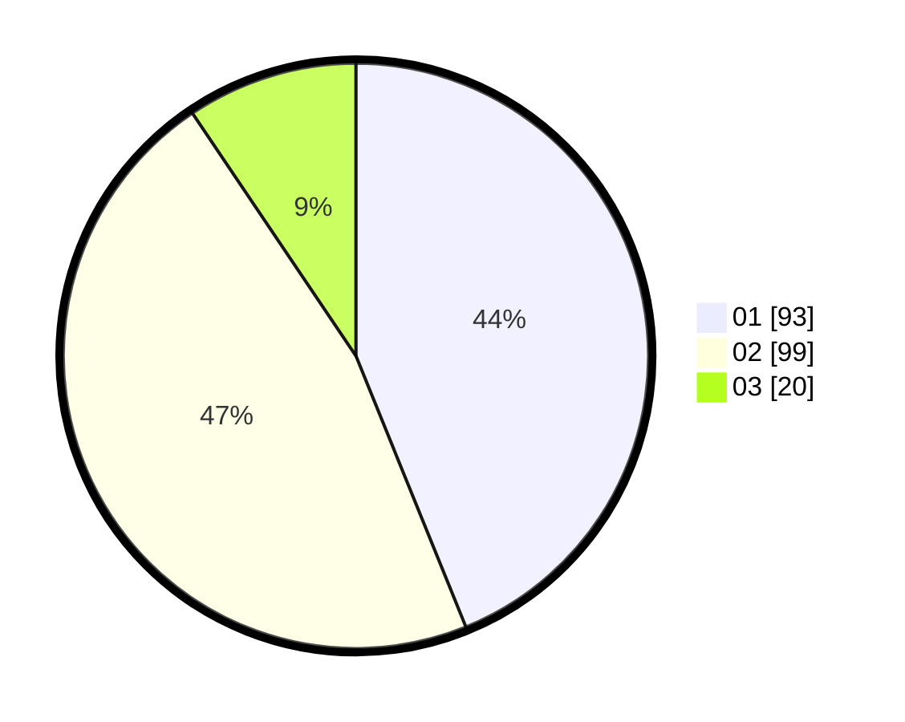

# Hasil

Hasil perolehan suara paslon dapat dilihat pada file paslon-01.txt, paslon-02.txt, dan paslon-03.txt.

Jika tidak ada, artinya data tersebut belum ada pada SIREKAP.

## Perolehan Suara

 * Paslon 01: **93**.
 * Paslon 02: **99**.
 * Paslon 03: **20**.

## Foto C Plano

https://sirekap-obj-formc.kpu.go.id/0425/pemilu/ppwp/31/71/05/10/03/3171051003059-20240215-153815--758d2135-904b-4dbf-90b3-23b061632f56.jpg

https://sirekap-obj-formc.kpu.go.id/0425/pemilu/ppwp/31/71/05/10/03/3171051003059-20240215-154017--3e33f4bb-1e69-47ef-a1b7-e7e059396508.jpg

https://sirekap-obj-formc.kpu.go.id/0425/pemilu/ppwp/31/71/05/10/03/3171051003059-20240215-154112--fe8ec81c-1b5a-4ca4-a28a-607f473dc2ec.jpg

## DATA PEMILIH TETAP

Jumlah pemilih dalam DPT: **273**.
 * L: **129**.
 * P: **144**.

## DATA PENGGUNA HAK PILIH

Jumlah pengguna hak pilih dalam DPT: **208**.
 * L: **93**.
 * P: **115**.

Jumlah pengguna hak pilih dalam DPTb: **1**.
 * L: **1**.
 * P: **0**.

Jumlah pengguna hak pilih dalam DPK: **6**.
 * L: **2**.
 * P: **4**.

Jumlah pengguna hak pilih: **215**.
 * L: **96**.
 * P: **119**.

## JUMLAH SUARA SAH DAN TIDAK SAH

JUMLAH SELURUH SUARA SAH: **212**.

JUMLAH SUARA TIDAK SAH: **3**.

JUMLAH SELURUH SUARA SAH DAN SUARA TIDAK SAH: **215**.
