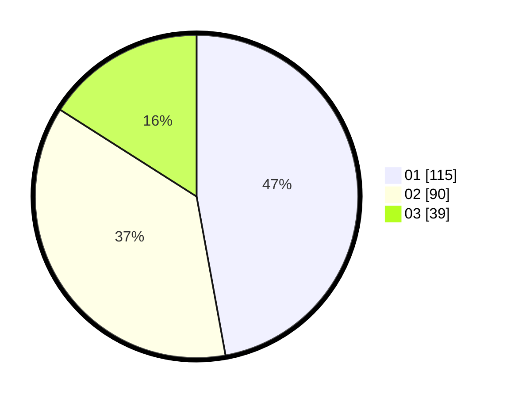

# Hasil

Hasil perolehan suara paslon dapat dilihat pada file paslon-01.txt, paslon-02.txt, dan paslon-03.txt.

Jika tidak ada, artinya data tersebut belum ada pada SIREKAP.

## Perolehan Suara

 * Paslon 01: **115**.
 * Paslon 02: **90**.
 * Paslon 03: **39**.

## Foto C Plano

https://sirekap-obj-formc.kpu.go.id/86d2/pemilu/ppwp/31/71/05/10/03/3171051003062-20240215-211258--15fb3f4a-4882-48a6-a042-a26ef91920c3.jpg

https://sirekap-obj-formc.kpu.go.id/86d2/pemilu/ppwp/31/71/05/10/03/3171051003062-20240215-211301--62baab06-f46f-45d7-9df2-6eaf42b9ddca.jpg

https://sirekap-obj-formc.kpu.go.id/86d2/pemilu/ppwp/31/71/05/10/03/3171051003062-20240215-211300--5457ea62-ac84-4a8a-ac7a-4cd70bc1ef04.jpg

## DATA PEMILIH TETAP

Jumlah pemilih dalam DPT: **286**.
 * L: **141**.
 * P: **145**.

## DATA PENGGUNA HAK PILIH

Jumlah pengguna hak pilih dalam DPT: **235**.
 * L: **116**.
 * P: **119**.

Jumlah pengguna hak pilih dalam DPTb: **12**.
 * L: **8**.
 * P: **4**.

Jumlah pengguna hak pilih dalam DPK: **1**.
 * L: **0**.
 * P: **1**.

Jumlah pengguna hak pilih: **248**.
 * L: **124**.
 * P: **124**.

## JUMLAH SUARA SAH DAN TIDAK SAH

JUMLAH SELURUH SUARA SAH: **244**.

JUMLAH SUARA TIDAK SAH: **4**.

JUMLAH SELURUH SUARA SAH DAN SUARA TIDAK SAH: **248**.
