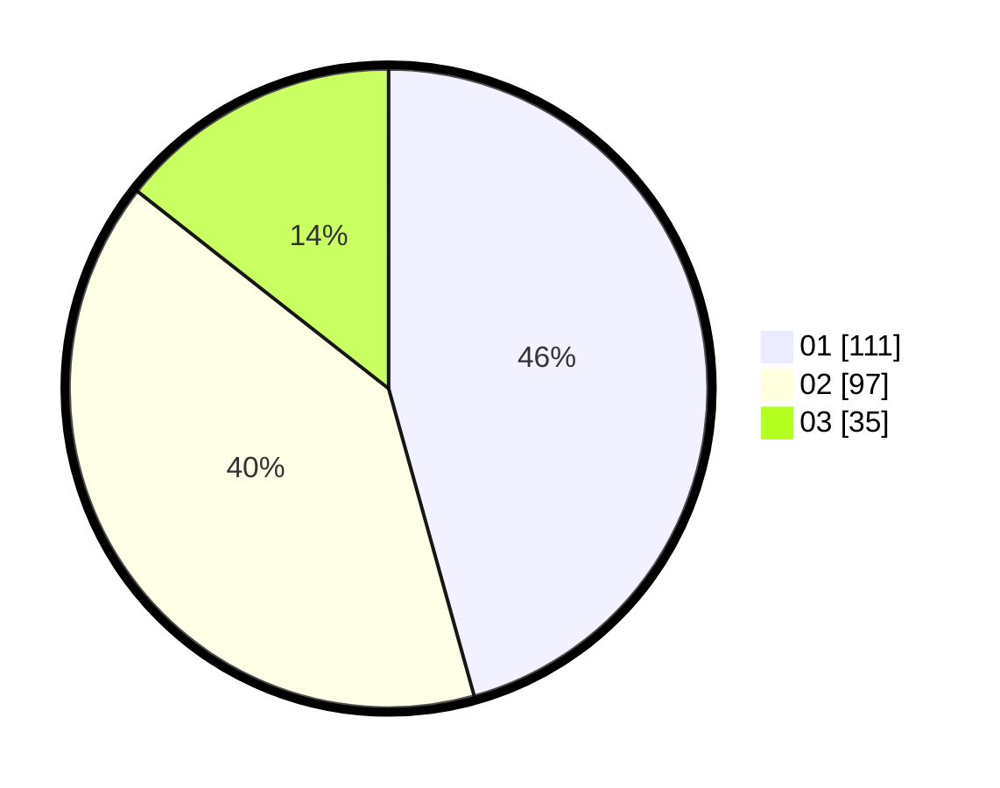

# Hasil

Hasil perolehan suara paslon dapat dilihat pada file paslon-01.txt, paslon-02.txt, dan paslon-03.txt.

Jika tidak ada, artinya data tersebut belum ada pada SIREKAP.

## Perolehan Suara

 * Paslon 01: **111**.
 * Paslon 02: **97**.
 * Paslon 03: **35**.

## Foto C Plano

https://sirekap-obj-formc.kpu.go.id/3de0/pemilu/ppwp/31/71/05/10/03/3171051003064-20240214-231617--06d9857d-314b-4ffc-a972-f3bb79263f6a.jpg

https://sirekap-obj-formc.kpu.go.id/3de0/pemilu/ppwp/31/71/05/10/03/3171051003064-20240214-231711--6319581c-aeaf-4dd6-87ae-cec797c40d3e.jpg

https://sirekap-obj-formc.kpu.go.id/3de0/pemilu/ppwp/31/71/05/10/03/3171051003064-20240214-231754--4085403a-8931-4865-bbed-3ab82e319449.jpg

## DATA PEMILIH TETAP

Jumlah pemilih dalam DPT: **282**.
 * L: **135**.
 * P: **147**.

## DATA PENGGUNA HAK PILIH

Jumlah pengguna hak pilih dalam DPT: **233**.
 * L: **107**.
 * P: **126**.

Jumlah pengguna hak pilih dalam DPTb: **7**.
 * L: **2**.
 * P: **5**.

Jumlah pengguna hak pilih dalam DPK: **8**.
 * L: **4**.
 * P: **4**.

Jumlah pengguna hak pilih: **248**.
 * L: **113**.
 * P: **135**.

## JUMLAH SUARA SAH DAN TIDAK SAH

JUMLAH SELURUH SUARA SAH: **243**.

JUMLAH SUARA TIDAK SAH: **5**.

JUMLAH SELURUH SUARA SAH DAN SUARA TIDAK SAH: **248**.
