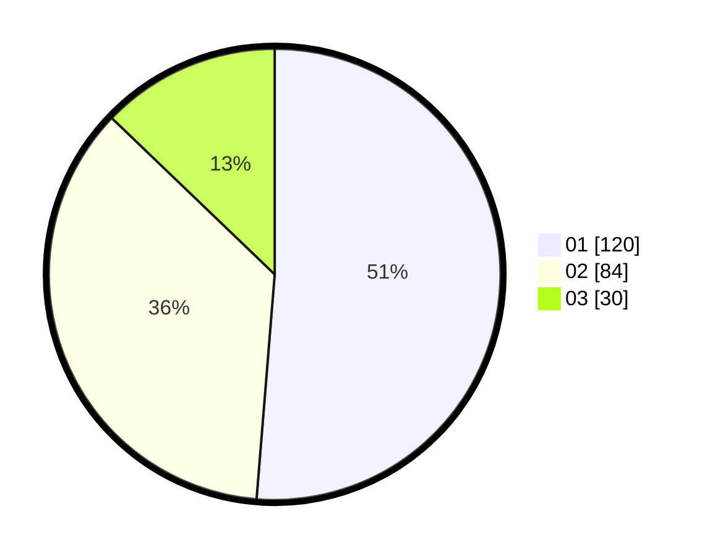

# Hasil

Hasil perolehan suara paslon dapat dilihat pada file paslon-01.txt, paslon-02.txt, dan paslon-03.txt.

Jika tidak ada, artinya data tersebut belum ada pada SIREKAP.

## Perolehan Suara

 * Paslon 01: **120**.
 * Paslon 02: **84**.
 * Paslon 03: **30**.

## Foto C Plano

https://sirekap-obj-formc.kpu.go.id/b148/pemilu/ppwp/31/71/05/10/03/3171051003065-20240214-184531--62dcb53a-9c61-4a98-b605-eb0396f90c0d.jpg

https://sirekap-obj-formc.kpu.go.id/b148/pemilu/ppwp/31/71/05/10/03/3171051003065-20240216-001824--bce835d5-fc71-4ad0-a42c-c57d0da4e554.jpg

https://sirekap-obj-formc.kpu.go.id/b148/pemilu/ppwp/31/71/05/10/03/3171051003065-20240214-184528--1d87cfc0-bf32-4be6-8337-333dace551df.jpg

## DATA PEMILIH TETAP

Jumlah pemilih dalam DPT: **280**.
 * L: **144**.
 * P: **136**.

## DATA PENGGUNA HAK PILIH

Jumlah pengguna hak pilih dalam DPT: **223**.
 * L: **116**.
 * P: **107**.

Jumlah pengguna hak pilih dalam DPTb: **10**.
 * L: **5**.
 * P: **5**.

Jumlah pengguna hak pilih dalam DPK: **4**.
 * L: **1**.
 * P: **3**.

Jumlah pengguna hak pilih: **237**.
 * L: **122**.
 * P: **115**.

## JUMLAH SUARA SAH DAN TIDAK SAH

JUMLAH SELURUH SUARA SAH: **234**.

JUMLAH SUARA TIDAK SAH: **3**.

JUMLAH SELURUH SUARA SAH DAN SUARA TIDAK SAH: **237**.
