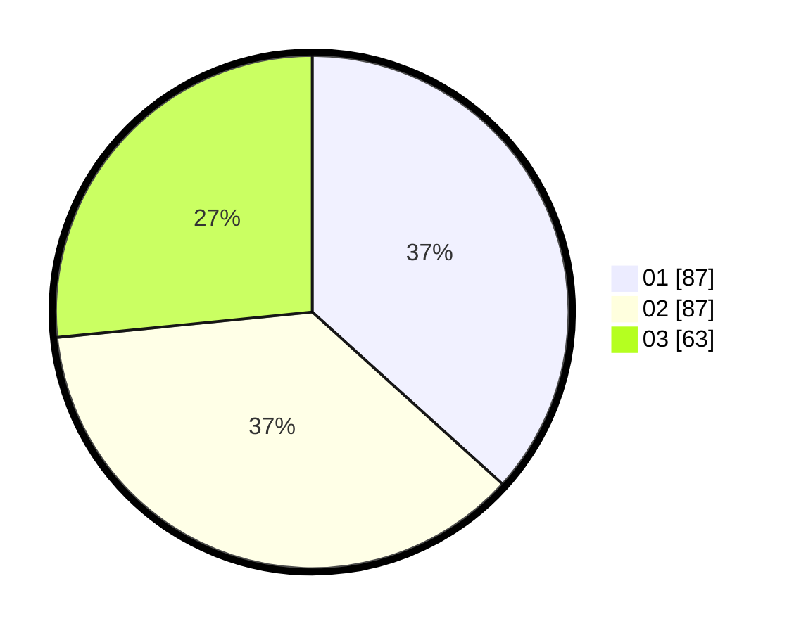

# Hasil

Hasil perolehan suara paslon dapat dilihat pada file paslon-01.txt, paslon-02.txt, dan paslon-03.txt.

Jika tidak ada, artinya data tersebut belum ada pada SIREKAP.

## Perolehan Suara

 * Paslon 01: **87**.
 * Paslon 02: **87**.
 * Paslon 03: **63**.

## Foto C Plano

https://sirekap-obj-formc.kpu.go.id/b9d6/pemilu/ppwp/31/71/05/10/03/3171051003067-20240216-052212--22cff407-2b7f-4466-ace9-9548a92807f2.jpg

https://sirekap-obj-formc.kpu.go.id/b9d6/pemilu/ppwp/31/71/05/10/03/3171051003067-20240216-052214--4bb26461-8968-4189-9d3f-897cf45a5817.jpg

https://sirekap-obj-formc.kpu.go.id/b9d6/pemilu/ppwp/31/71/05/10/03/3171051003067-20240216-052213--fb4793e9-28c3-4fcc-9ae1-0bcdd29ce224.jpg

## DATA PEMILIH TETAP

Jumlah pemilih dalam DPT: **297**.
 * L: **136**.
 * P: **161**.

## DATA PENGGUNA HAK PILIH

Jumlah pengguna hak pilih dalam DPT: **194**.
 * L: **87**.
 * P: **107**.

Jumlah pengguna hak pilih dalam DPTb: **24**.
 * L: **12**.
 * P: **12**.

Jumlah pengguna hak pilih dalam DPK: **22**.
 * L: **12**.
 * P: **10**.

Jumlah pengguna hak pilih: **240**.
 * L: **111**.
 * P: **129**.

## JUMLAH SUARA SAH DAN TIDAK SAH

JUMLAH SELURUH SUARA SAH: **237**.

JUMLAH SUARA TIDAK SAH: **3**.

JUMLAH SELURUH SUARA SAH DAN SUARA TIDAK SAH: **240**.
