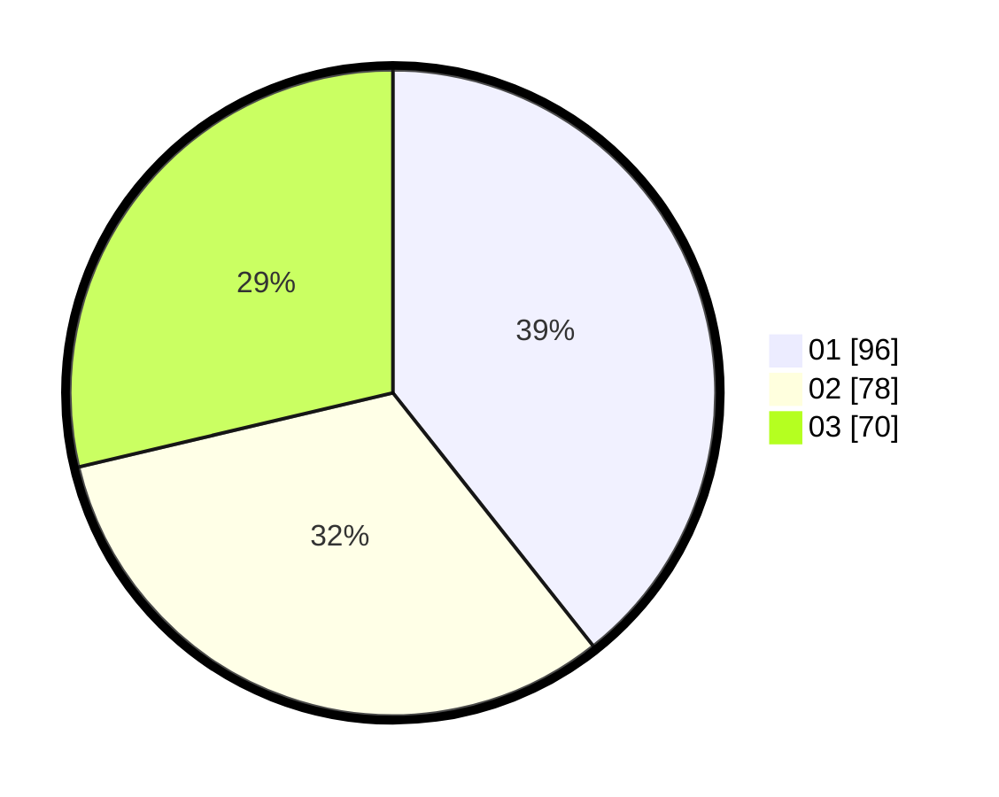

# Hasil

Hasil perolehan suara paslon dapat dilihat pada file paslon-01.txt, paslon-02.txt, dan paslon-03.txt.

Jika tidak ada, artinya data tersebut belum ada pada SIREKAP.

## Perolehan Suara

 * Paslon 01: **96**.
 * Paslon 02: **78**.
 * Paslon 03: **70**.

## Foto C Plano

https://sirekap-obj-formc.kpu.go.id/6caf/pemilu/ppwp/31/71/05/10/03/3171051003068-20240216-073914--83c24661-161e-46d3-a7c1-f8616bf804eb.jpg

https://sirekap-obj-formc.kpu.go.id/6caf/pemilu/ppwp/31/71/05/10/03/3171051003068-20240216-073916--7f4e5596-2cca-4ea4-bba4-bbb57de3ca12.jpg

https://sirekap-obj-formc.kpu.go.id/6caf/pemilu/ppwp/31/71/05/10/03/3171051003068-20240216-073915--8d109ad2-bbc6-4934-bf44-87a540781799.jpg

## DATA PEMILIH TETAP

Jumlah pemilih dalam DPT: **294**.
 * L: **139**.
 * P: **155**.

## DATA PENGGUNA HAK PILIH

Jumlah pengguna hak pilih dalam DPT: **219**.
 * L: **103**.
 * P: **116**.

Jumlah pengguna hak pilih dalam DPTb: **27**.
 * L: **9**.
 * P: **18**.

Jumlah pengguna hak pilih dalam DPK: **3**.
 * L: **1**.
 * P: **2**.

Jumlah pengguna hak pilih: **249**.
 * L: **113**.
 * P: **136**.

## JUMLAH SUARA SAH DAN TIDAK SAH

JUMLAH SELURUH SUARA SAH: **244**.

JUMLAH SUARA TIDAK SAH: **5**.

JUMLAH SELURUH SUARA SAH DAN SUARA TIDAK SAH: **249**.
