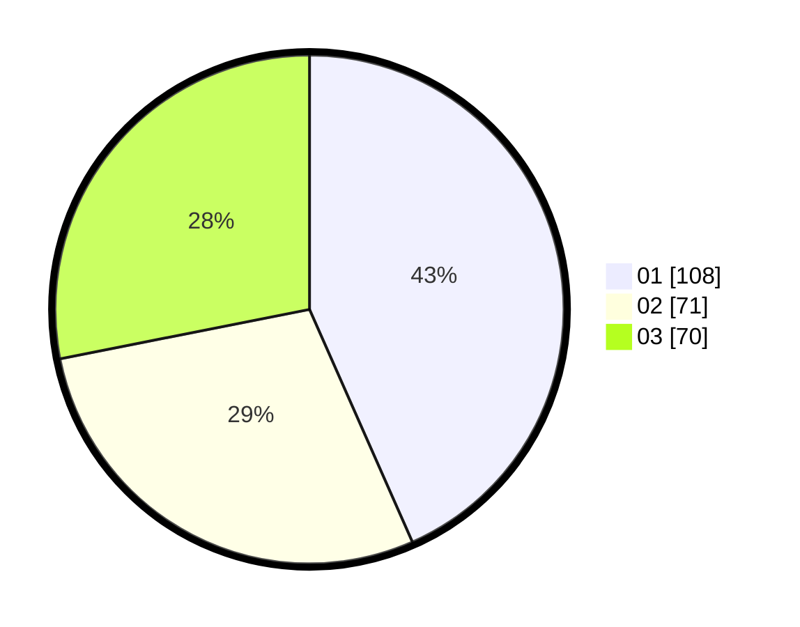

# Hasil

Hasil perolehan suara paslon dapat dilihat pada file paslon-01.txt, paslon-02.txt, dan paslon-03.txt.

Jika tidak ada, artinya data tersebut belum ada pada SIREKAP.

## Perolehan Suara

 * Paslon 01: **108**.
 * Paslon 02: **71**.
 * Paslon 03: **70**.

## Foto C Plano

https://sirekap-obj-formc.kpu.go.id/989c/pemilu/ppwp/31/71/05/10/03/3171051003069-20240214-220236--c75bdde1-61fa-491e-bc27-fc9621b01066.jpg

https://sirekap-obj-formc.kpu.go.id/989c/pemilu/ppwp/31/71/05/10/03/3171051003069-20240214-201728--2056eec5-9e6d-4987-aade-af18fd93adae.jpg

https://sirekap-obj-formc.kpu.go.id/989c/pemilu/ppwp/31/71/05/10/03/3171051003069-20240214-201745--f8d35c57-0c73-476f-8a38-74ea32bff527.jpg

## DATA PEMILIH TETAP

Jumlah pemilih dalam DPT: **291**.
 * L: **142**.
 * P: **149**.

## DATA PENGGUNA HAK PILIH

Jumlah pengguna hak pilih dalam DPT: **225**.
 * L: **104**.
 * P: **121**.

Jumlah pengguna hak pilih dalam DPTb: **22**.
 * L: **9**.
 * P: **13**.

Jumlah pengguna hak pilih dalam DPK: **7**.
 * L: **3**.
 * P: **4**.

Jumlah pengguna hak pilih: **254**.
 * L: **116**.
 * P: **138**.

## JUMLAH SUARA SAH DAN TIDAK SAH

JUMLAH SELURUH SUARA SAH: **249**.

JUMLAH SUARA TIDAK SAH: **5**.

JUMLAH SELURUH SUARA SAH DAN SUARA TIDAK SAH: **254**.
