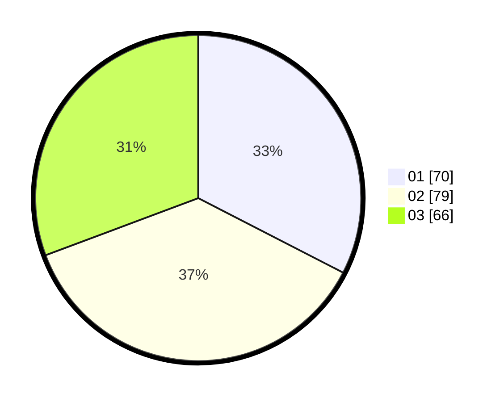

# Hasil

Hasil perolehan suara paslon dapat dilihat pada file paslon-01.txt, paslon-02.txt, dan paslon-03.txt.

Jika tidak ada, artinya data tersebut belum ada pada SIREKAP.

## Perolehan Suara

 * Paslon 01: **70**.
 * Paslon 02: **79**.
 * Paslon 03: **66**.

## Foto C Plano

https://sirekap-obj-formc.kpu.go.id/c844/pemilu/ppwp/31/71/05/10/03/3171051003070-20240215-022402--51fc86c6-6541-48fd-9d23-51cf1977a14f.jpg

https://sirekap-obj-formc.kpu.go.id/c844/pemilu/ppwp/31/71/05/10/03/3171051003070-20240215-022637--91c9f03f-a965-48a1-a4df-c01a97b9ff1e.jpg

https://sirekap-obj-formc.kpu.go.id/c844/pemilu/ppwp/31/71/05/10/03/3171051003070-20240215-023003--8597185f-bbab-4c22-8fcd-05b12ee955cf.jpg

## DATA PEMILIH TETAP

Jumlah pemilih dalam DPT: **293**.
 * L: **152**.
 * P: **141**.

## DATA PENGGUNA HAK PILIH

Jumlah pengguna hak pilih dalam DPT: **197**.
 * L: **98**.
 * P: **99**.

Jumlah pengguna hak pilih dalam DPTb: **20**.
 * L: **10**.
 * P: **10**.

Jumlah pengguna hak pilih dalam DPK: **3**.
 * L: **1**.
 * P: **2**.

Jumlah pengguna hak pilih: **220**.
 * L: **109**.
 * P: **111**.

## JUMLAH SUARA SAH DAN TIDAK SAH

JUMLAH SELURUH SUARA SAH: **215**.

JUMLAH SUARA TIDAK SAH: **5**.

JUMLAH SELURUH SUARA SAH DAN SUARA TIDAK SAH: **220**.
