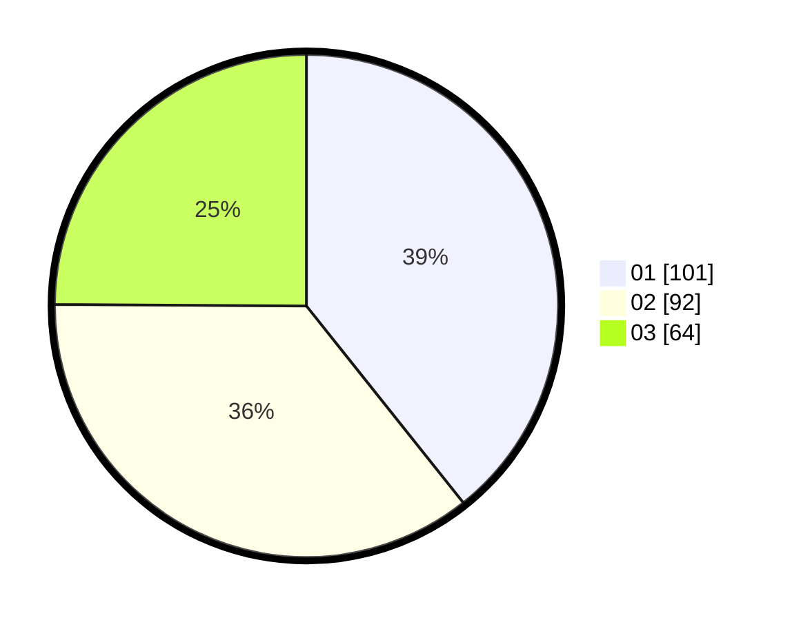

# Hasil

Hasil perolehan suara paslon dapat dilihat pada file paslon-01.txt, paslon-02.txt, dan paslon-03.txt.

Jika tidak ada, artinya data tersebut belum ada pada SIREKAP.

## Perolehan Suara

 * Paslon 01: **101**.
 * Paslon 02: **92**.
 * Paslon 03: **64**.

## Foto C Plano

https://sirekap-obj-formc.kpu.go.id/1cef/pemilu/ppwp/31/71/05/10/03/3171051003072-20240215-024241--6fa8b131-6248-4e49-9779-a36c31a678be.jpg

https://sirekap-obj-formc.kpu.go.id/1cef/pemilu/ppwp/31/71/05/10/03/3171051003072-20240215-024330--784b0af4-b0cd-4a1b-8d6a-b80b16785b78.jpg

https://sirekap-obj-formc.kpu.go.id/1cef/pemilu/ppwp/31/71/05/10/03/3171051003072-20240215-024424--8a8eec1a-1e94-4dc8-8369-c4a7c0fd3d70.jpg

## DATA PEMILIH TETAP

Jumlah pemilih dalam DPT: **298**.
 * L: **139**.
 * P: **159**.

## DATA PENGGUNA HAK PILIH

Jumlah pengguna hak pilih dalam DPT: **233**.
 * L: **109**.
 * P: **124**.

Jumlah pengguna hak pilih dalam DPTb: **23**.
 * L: **10**.
 * P: **13**.

Jumlah pengguna hak pilih dalam DPK: **3**.
 * L: **2**.
 * P: **1**.

Jumlah pengguna hak pilih: **259**.
 * L: **121**.
 * P: **138**.

## JUMLAH SUARA SAH DAN TIDAK SAH

JUMLAH SELURUH SUARA SAH: **257**.

JUMLAH SUARA TIDAK SAH: **2**.

JUMLAH SELURUH SUARA SAH DAN SUARA TIDAK SAH: **259**.
