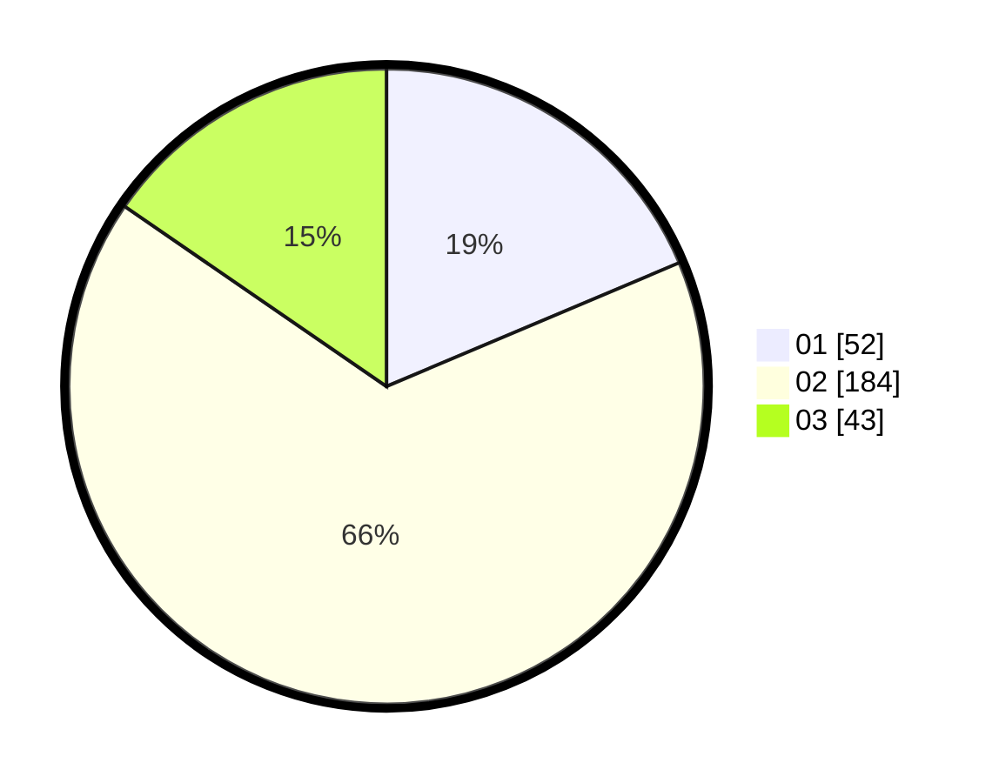

# Hasil

Hasil perolehan suara paslon dapat dilihat pada file paslon-01.txt, paslon-02.txt, dan paslon-03.txt.

Jika tidak ada, artinya data tersebut belum ada pada SIREKAP.

## Perolehan Suara

 * Paslon 01: **52**.
 * Paslon 02: **184**.
 * Paslon 03: **43**.

## Foto C Plano

https://sirekap-obj-formc.kpu.go.id/148a/pemilu/ppwp/31/71/05/10/03/3171051003902-20240214-194634--9889499a-8f44-4bdf-9aab-0715222e0497.jpg

https://sirekap-obj-formc.kpu.go.id/148a/pemilu/ppwp/31/71/05/10/03/3171051003902-20240214-194921--e0bb8665-7dd0-4e21-9713-141b377debe9.jpg

https://sirekap-obj-formc.kpu.go.id/148a/pemilu/ppwp/31/71/05/10/03/3171051003902-20240214-185420--79387e64-de3d-4419-abdb-c4aa39cd0c1d.jpg

## DATA PEMILIH TETAP

Jumlah pemilih dalam DPT: **272**.
 * L: **272**.
 * P: **0**.

## DATA PENGGUNA HAK PILIH

Jumlah pengguna hak pilih dalam DPT: **123**.
 * L: **123**.
 * P: **0**.

Jumlah pengguna hak pilih dalam DPTb: **165**.
 * L: **165**.
 * P: **0**.

Jumlah pengguna hak pilih dalam DPK: **0**.
 * L: **0**.
 * P: **0**.

Jumlah pengguna hak pilih: **288**.
 * L: **288**.
 * P: **0**.

## JUMLAH SUARA SAH DAN TIDAK SAH

JUMLAH SELURUH SUARA SAH: **279**.

JUMLAH SUARA TIDAK SAH: **9**.

JUMLAH SELURUH SUARA SAH DAN SUARA TIDAK SAH: **288**.
