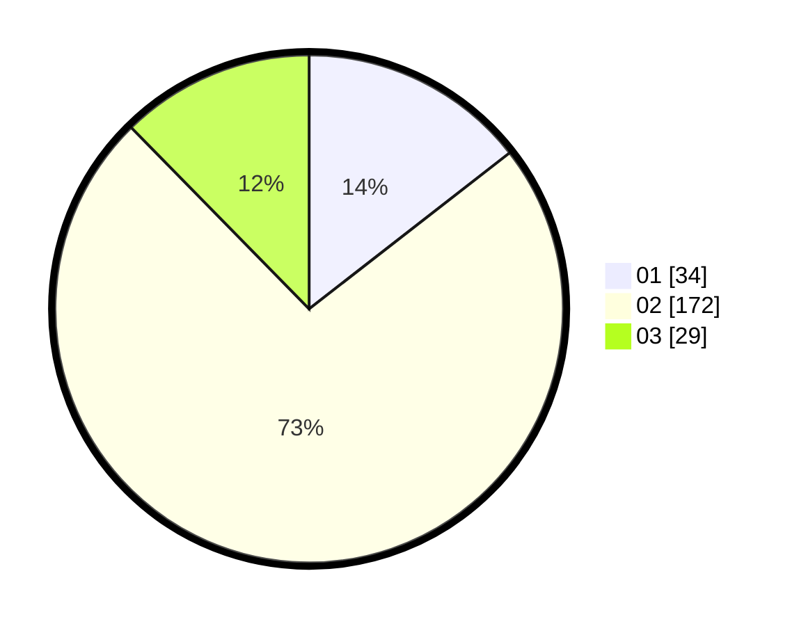

# Hasil

Hasil perolehan suara paslon dapat dilihat pada file paslon-01.txt, paslon-02.txt, dan paslon-03.txt.

Jika tidak ada, artinya data tersebut belum ada pada SIREKAP.

## Perolehan Suara

 * Paslon 01: **34**.
 * Paslon 02: **172**.
 * Paslon 03: **29**.

## Foto C Plano

https://sirekap-obj-formc.kpu.go.id/7243/pemilu/ppwp/31/71/05/10/03/3171051003904-20240216-074109--647f3aba-4fcb-4d28-bdd4-1d59b413186d.jpg

https://sirekap-obj-formc.kpu.go.id/7243/pemilu/ppwp/31/71/05/10/03/3171051003904-20240216-074126--07d717b2-60b4-49aa-9c46-5ea64c5fdecd.jpg

https://sirekap-obj-formc.kpu.go.id/7243/pemilu/ppwp/31/71/05/10/03/3171051003904-20240216-074118--47ee77b8-5a43-4e78-9a0c-72378991736e.jpg

## DATA PEMILIH TETAP

Jumlah pemilih dalam DPT: **263**.
 * L: **263**.
 * P: **0**.

## DATA PENGGUNA HAK PILIH

Jumlah pengguna hak pilih dalam DPT: **111**.
 * L: **111**.
 * P: **0**.

Jumlah pengguna hak pilih dalam DPTb: **133**.
 * L: **133**.
 * P: **0**.

Jumlah pengguna hak pilih dalam DPK: **0**.
 * L: **0**.
 * P: **0**.

Jumlah pengguna hak pilih: **244**.
 * L: **244**.
 * P: **0**.

## JUMLAH SUARA SAH DAN TIDAK SAH

JUMLAH SELURUH SUARA SAH: **235**.

JUMLAH SUARA TIDAK SAH: **9**.

JUMLAH SELURUH SUARA SAH DAN SUARA TIDAK SAH: **244**.
