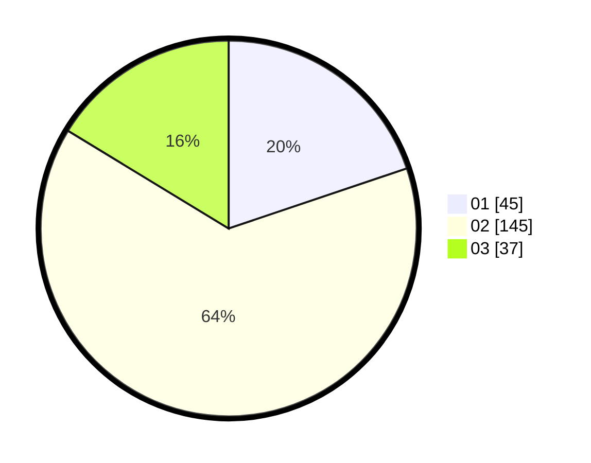

# Hasil

Hasil perolehan suara paslon dapat dilihat pada file paslon-01.txt, paslon-02.txt, dan paslon-03.txt.

Jika tidak ada, artinya data tersebut belum ada pada SIREKAP.

## Perolehan Suara

 * Paslon 01: **45**.
 * Paslon 02: **145**.
 * Paslon 03: **37**.

## Foto C Plano

https://sirekap-obj-formc.kpu.go.id/dd0f/pemilu/ppwp/31/71/05/10/03/3171051003909-20240216-132742--2e08cfa6-8b27-40cf-a78a-0e723f8ff14b.jpg

https://sirekap-obj-formc.kpu.go.id/dd0f/pemilu/ppwp/31/71/05/10/03/3171051003909-20240216-132743--abb2bcfb-bb37-4c29-bbeb-1402e1d8a7ac.jpg

https://sirekap-obj-formc.kpu.go.id/dd0f/pemilu/ppwp/31/71/05/10/03/3171051003909-20240216-132742--ec89240a-bfa5-4cce-a2b4-1221f64c0d3a.jpg

## DATA PEMILIH TETAP

Jumlah pemilih dalam DPT: **260**.
 * L: **260**.
 * P: **0**.

## DATA PENGGUNA HAK PILIH

Jumlah pengguna hak pilih dalam DPT: **76**.
 * L: **76**.
 * P: **0**.

Jumlah pengguna hak pilih dalam DPTb: **155**.
 * L: **153**.
 * P: **2**.

Jumlah pengguna hak pilih dalam DPK: **0**.
 * L: **0**.
 * P: **0**.

Jumlah pengguna hak pilih: **231**.
 * L: **229**.
 * P: **2**.

## JUMLAH SUARA SAH DAN TIDAK SAH

JUMLAH SELURUH SUARA SAH: **227**.

JUMLAH SUARA TIDAK SAH: **4**.

JUMLAH SELURUH SUARA SAH DAN SUARA TIDAK SAH: **231**.
