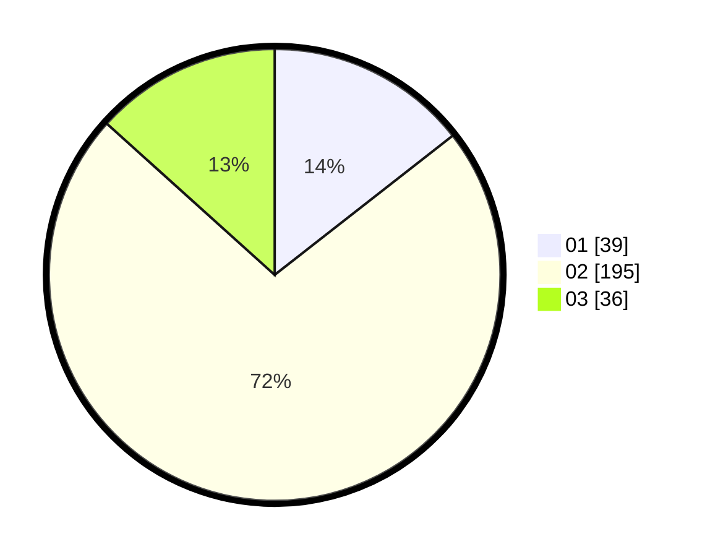

# Hasil

Hasil perolehan suara paslon dapat dilihat pada file paslon-01.txt, paslon-02.txt, dan paslon-03.txt.

Jika tidak ada, artinya data tersebut belum ada pada SIREKAP.

## Perolehan Suara

 * Paslon 01: **39**.
 * Paslon 02: **195**.
 * Paslon 03: **36**.

## Foto C Plano

https://sirekap-obj-formc.kpu.go.id/dffd/pemilu/ppwp/31/71/05/10/03/3171051003916-20240216-070826--6c7582e7-381c-4965-9286-a897bc26df34.jpg

https://sirekap-obj-formc.kpu.go.id/dffd/pemilu/ppwp/31/71/05/10/03/3171051003916-20240216-070828--f3c39f0a-1ca6-4bd9-81cf-034e76af4a58.jpg

https://sirekap-obj-formc.kpu.go.id/dffd/pemilu/ppwp/31/71/05/10/03/3171051003916-20240216-070827--465b06bc-4dfd-48d7-85ce-67b6458316ca.jpg

## DATA PEMILIH TETAP

Jumlah pemilih dalam DPT: **270**.
 * L: **270**.
 * P: **0**.

## DATA PENGGUNA HAK PILIH

Jumlah pengguna hak pilih dalam DPT: **106**.
 * L: **106**.
 * P: **0**.

Jumlah pengguna hak pilih dalam DPTb: **167**.
 * L: **166**.
 * P: **1**.

Jumlah pengguna hak pilih dalam DPK: **0**.
 * L: **0**.
 * P: **0**.

Jumlah pengguna hak pilih: **273**.
 * L: **272**.
 * P: **1**.

## JUMLAH SUARA SAH DAN TIDAK SAH

JUMLAH SELURUH SUARA SAH: **270**.

JUMLAH SUARA TIDAK SAH: **3**.

JUMLAH SELURUH SUARA SAH DAN SUARA TIDAK SAH: **273**.
