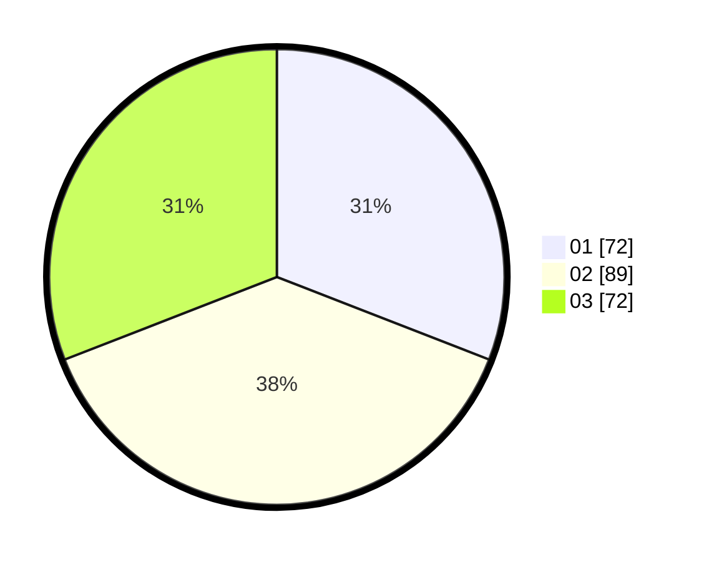

# Hasil

Hasil perolehan suara paslon dapat dilihat pada file paslon-01.txt, paslon-02.txt, dan paslon-03.txt.

Jika tidak ada, artinya data tersebut belum ada pada SIREKAP.

## Perolehan Suara

 * Paslon 01: **72**.
 * Paslon 02: **89**.
 * Paslon 03: **72**.

## Foto C Plano

https://sirekap-obj-formc.kpu.go.id/5d43/pemilu/ppwp/31/71/06/10/01/3171061001015-20240215-211719--200d8461-6e1d-4a7e-b4cb-8de9e7b82067.jpg

https://sirekap-obj-formc.kpu.go.id/5d43/pemilu/ppwp/31/71/06/10/01/3171061001015-20240215-211721--1fbed9be-210b-4314-b2ce-d2453aaba7fe.jpg

https://sirekap-obj-formc.kpu.go.id/5d43/pemilu/ppwp/31/71/06/10/01/3171061001015-20240215-211721--7d938230-8780-4976-b362-b968eee96bbb.jpg

## DATA PEMILIH TETAP

Jumlah pemilih dalam DPT: **286**.
 * L: **151**.
 * P: **135**.

## DATA PENGGUNA HAK PILIH

Jumlah pengguna hak pilih dalam DPT: **217**.
 * L: **115**.
 * P: **102**.

Jumlah pengguna hak pilih dalam DPTb: **17**.
 * L: **9**.
 * P: **8**.

Jumlah pengguna hak pilih dalam DPK: **4**.
 * L: **3**.
 * P: **1**.

Jumlah pengguna hak pilih: **238**.
 * L: **127**.
 * P: **111**.

## JUMLAH SUARA SAH DAN TIDAK SAH

JUMLAH SELURUH SUARA SAH: **233**.

JUMLAH SUARA TIDAK SAH: **5**.

JUMLAH SELURUH SUARA SAH DAN SUARA TIDAK SAH: **238**.
