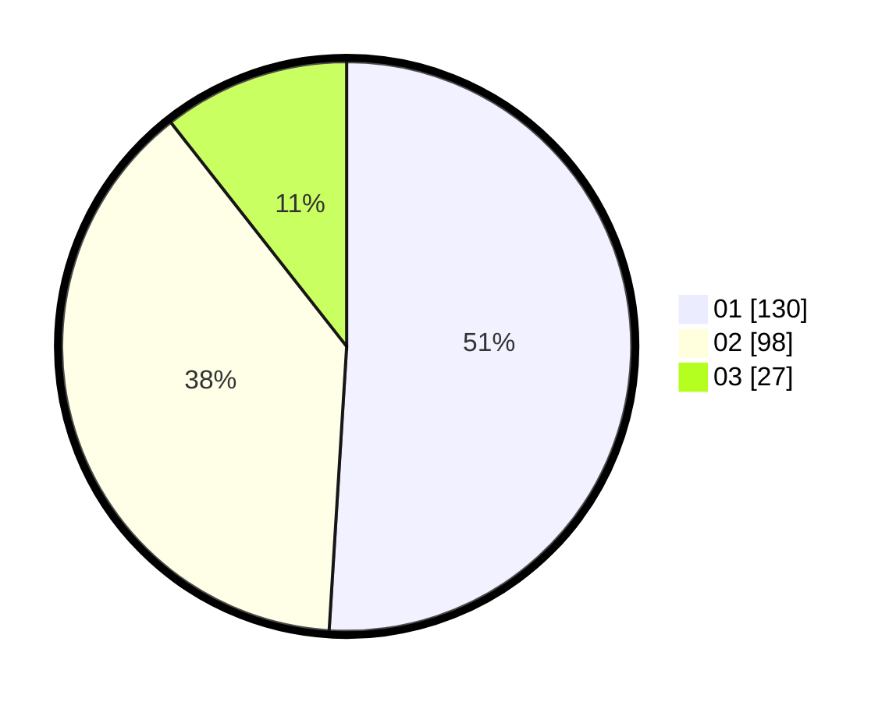

# Hasil

Hasil perolehan suara paslon dapat dilihat pada file paslon-01.txt, paslon-02.txt, dan paslon-03.txt.

Jika tidak ada, artinya data tersebut belum ada pada SIREKAP.

## Perolehan Suara

 * Paslon 01: **130**.
 * Paslon 02: **98**.
 * Paslon 03: **27**.

## Foto C Plano

https://sirekap-obj-formc.kpu.go.id/87ce/pemilu/ppwp/31/71/06/10/01/3171061001018-20240214-213510--a423ceac-fed6-44b8-9ea4-7e01ff7bd9f2.jpg

https://sirekap-obj-formc.kpu.go.id/87ce/pemilu/ppwp/31/71/06/10/01/3171061001018-20240214-213240--6633a176-4d62-416b-b76a-6cd09322cc7b.jpg

https://sirekap-obj-formc.kpu.go.id/87ce/pemilu/ppwp/31/71/06/10/01/3171061001018-20240214-213118--a9261cfd-4c6e-45f9-b400-853d9839e17c.jpg

## DATA PEMILIH TETAP

Jumlah pemilih dalam DPT: **290**.
 * L: **150**.
 * P: **140**.

## DATA PENGGUNA HAK PILIH

Jumlah pengguna hak pilih dalam DPT: **241**.
 * L: **127**.
 * P: **114**.

Jumlah pengguna hak pilih dalam DPTb: **13**.
 * L: **7**.
 * P: **6**.

Jumlah pengguna hak pilih dalam DPK: **3**.
 * L: **1**.
 * P: **2**.

Jumlah pengguna hak pilih: **257**.
 * L: **135**.
 * P: **122**.

## JUMLAH SUARA SAH DAN TIDAK SAH

JUMLAH SELURUH SUARA SAH: **254**.

JUMLAH SUARA TIDAK SAH: **3**.

JUMLAH SELURUH SUARA SAH DAN SUARA TIDAK SAH: **257**.
