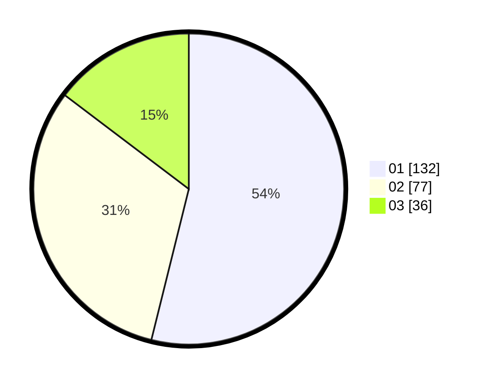

# Hasil

Hasil perolehan suara paslon dapat dilihat pada file paslon-01.txt, paslon-02.txt, dan paslon-03.txt.

Jika tidak ada, artinya data tersebut belum ada pada SIREKAP.

## Perolehan Suara

 * Paslon 01: **132**.
 * Paslon 02: **77**.
 * Paslon 03: **36**.

## Foto C Plano

https://sirekap-obj-formc.kpu.go.id/2bc7/pemilu/ppwp/31/71/06/10/01/3171061001019-20240214-182247--21b089de-3c57-4af8-a273-663d84826b35.jpg

https://sirekap-obj-formc.kpu.go.id/2bc7/pemilu/ppwp/31/71/06/10/01/3171061001019-20240214-184504--273839d8-63a3-4db6-84f8-9ddaa01eef1a.jpg

https://sirekap-obj-formc.kpu.go.id/2bc7/pemilu/ppwp/31/71/06/10/01/3171061001019-20240214-181234--650c7a2d-74ee-4e44-a2c0-af1783b87b72.jpg

## DATA PEMILIH TETAP

Jumlah pemilih dalam DPT: **286**.
 * L: **147**.
 * P: **139**.

## DATA PENGGUNA HAK PILIH

Jumlah pengguna hak pilih dalam DPT: **234**.
 * L: **117**.
 * P: **117**.

Jumlah pengguna hak pilih dalam DPTb: **17**.
 * L: **11**.
 * P: **6**.

Jumlah pengguna hak pilih dalam DPK: **1**.
 * L: **0**.
 * P: **1**.

Jumlah pengguna hak pilih: **252**.
 * L: **128**.
 * P: **124**.

## JUMLAH SUARA SAH DAN TIDAK SAH

JUMLAH SELURUH SUARA SAH: **245**.

JUMLAH SUARA TIDAK SAH: **5**.

JUMLAH SELURUH SUARA SAH DAN SUARA TIDAK SAH: **250**.
