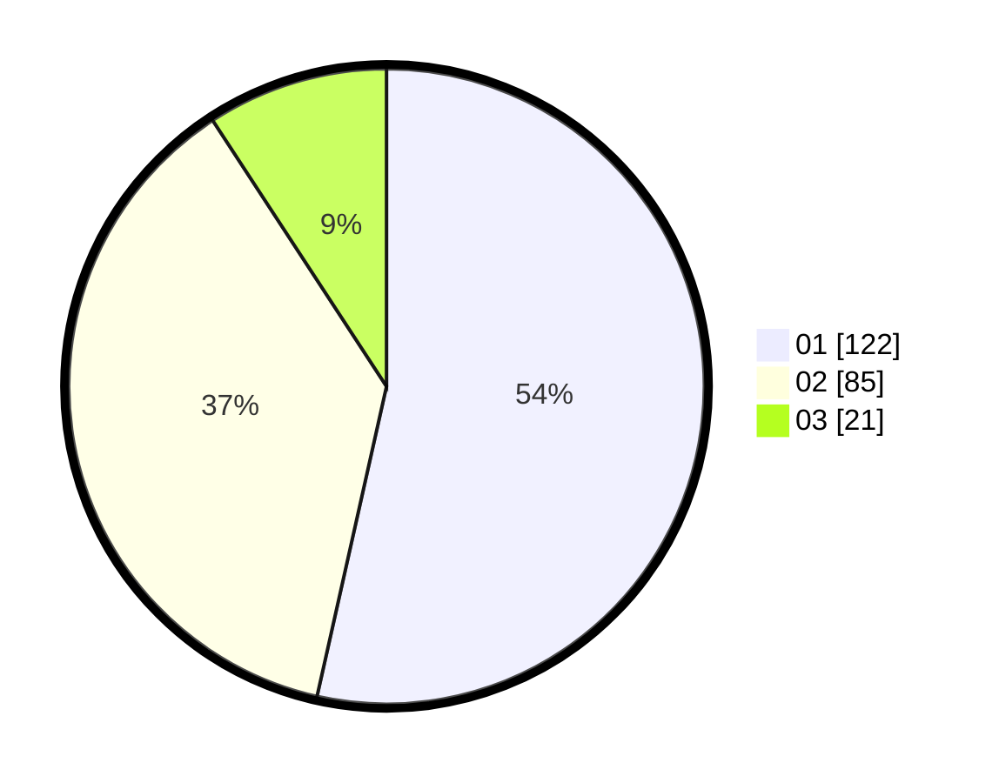

# Hasil

Hasil perolehan suara paslon dapat dilihat pada file paslon-01.txt, paslon-02.txt, dan paslon-03.txt.

Jika tidak ada, artinya data tersebut belum ada pada SIREKAP.

## Perolehan Suara

 * Paslon 01: **122**.
 * Paslon 02: **85**.
 * Paslon 03: **21**.

## Foto C Plano

https://sirekap-obj-formc.kpu.go.id/2f67/pemilu/ppwp/31/71/06/10/01/3171061001027-20240214-235338--d8297fe7-1b1e-49ad-a7f9-327a4acfec46.jpg

https://sirekap-obj-formc.kpu.go.id/2f67/pemilu/ppwp/31/71/06/10/01/3171061001027-20240214-235455--ae9ca7e0-4484-41b8-8e9e-f9cee2d54764.jpg

https://sirekap-obj-formc.kpu.go.id/2f67/pemilu/ppwp/31/71/06/10/01/3171061001027-20240214-235538--b3a06a6d-2d06-480f-bb5a-7fb6c1cce615.jpg

## DATA PEMILIH TETAP

Jumlah pemilih dalam DPT: **282**.
 * L: **128**.
 * P: **388**.

## DATA PENGGUNA HAK PILIH

Jumlah pengguna hak pilih dalam DPT: **226**.
 * L: **111**.
 * P: **115**.

Jumlah pengguna hak pilih dalam DPTb: **3**.
 * L: **1**.
 * P: **2**.

Jumlah pengguna hak pilih dalam DPK: **9**.
 * L: **2**.
 * P: **2**.

Jumlah pengguna hak pilih: **233**.
 * L: **119**.
 * P: **119**.

## JUMLAH SUARA SAH DAN TIDAK SAH

JUMLAH SELURUH SUARA SAH: **228**.

JUMLAH SUARA TIDAK SAH: **5**.

JUMLAH SELURUH SUARA SAH DAN SUARA TIDAK SAH: **233**.
