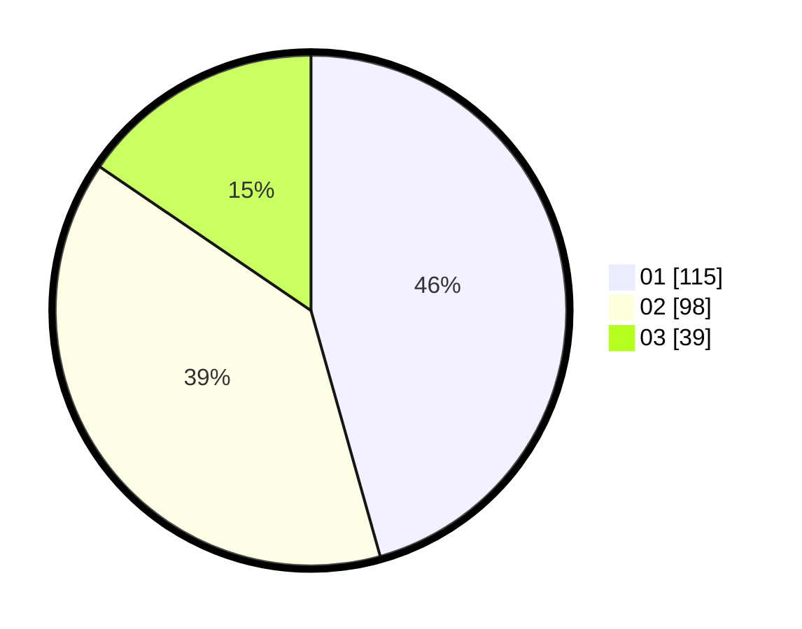

# Hasil

Hasil perolehan suara paslon dapat dilihat pada file paslon-01.txt, paslon-02.txt, dan paslon-03.txt.

Jika tidak ada, artinya data tersebut belum ada pada SIREKAP.

## Perolehan Suara

 * Paslon 01: **115**.
 * Paslon 02: **98**.
 * Paslon 03: **39**.

## Foto C Plano

https://sirekap-obj-formc.kpu.go.id/b162/pemilu/ppwp/31/71/06/10/01/3171061001031-20240214-155807--bb1f269b-dfb3-4abd-9f6c-a0255f641318.jpg

https://sirekap-obj-formc.kpu.go.id/b162/pemilu/ppwp/31/71/06/10/01/3171061001031-20240214-155918--e805423c-f189-42de-b485-5f3b2554cf51.jpg

https://sirekap-obj-formc.kpu.go.id/b162/pemilu/ppwp/31/71/06/10/01/3171061001031-20240214-160118--2c24e23d-a584-4628-bc20-78b0ac98d85c.jpg
