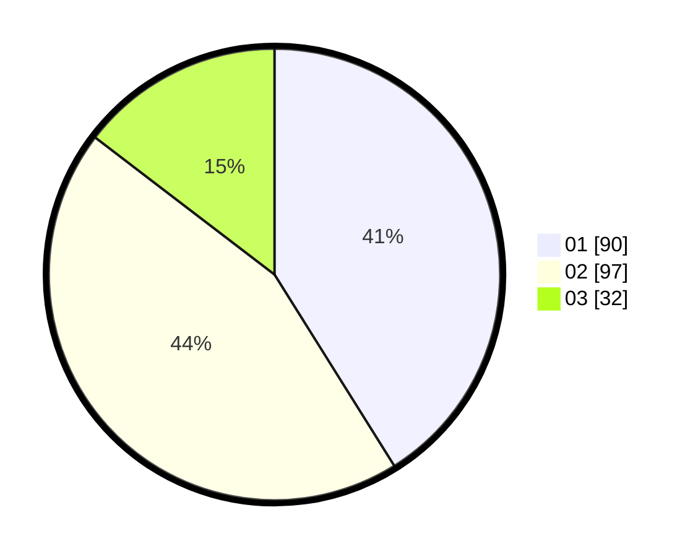

# Hasil

Hasil perolehan suara paslon dapat dilihat pada file paslon-01.txt, paslon-02.txt, dan paslon-03.txt.

Jika tidak ada, artinya data tersebut belum ada pada SIREKAP.

## Perolehan Suara

 * Paslon 01: **90**.
 * Paslon 02: **97**.
 * Paslon 03: **32**.

## Foto C Plano

https://sirekap-obj-formc.kpu.go.id/3ee6/pemilu/ppwp/31/71/06/10/01/3171061001032-20240215-011814--37ddea2c-8d13-4d29-8bf7-5fbdb799bffc.jpg

https://sirekap-obj-formc.kpu.go.id/3ee6/pemilu/ppwp/31/71/06/10/01/3171061001032-20240215-011932--fec0301c-2dce-41e5-8ad5-fc925036b024.jpg

https://sirekap-obj-formc.kpu.go.id/3ee6/pemilu/ppwp/31/71/06/10/01/3171061001032-20240215-012029--fc2b4f7d-308e-45f7-8874-5624b849f477.jpg
