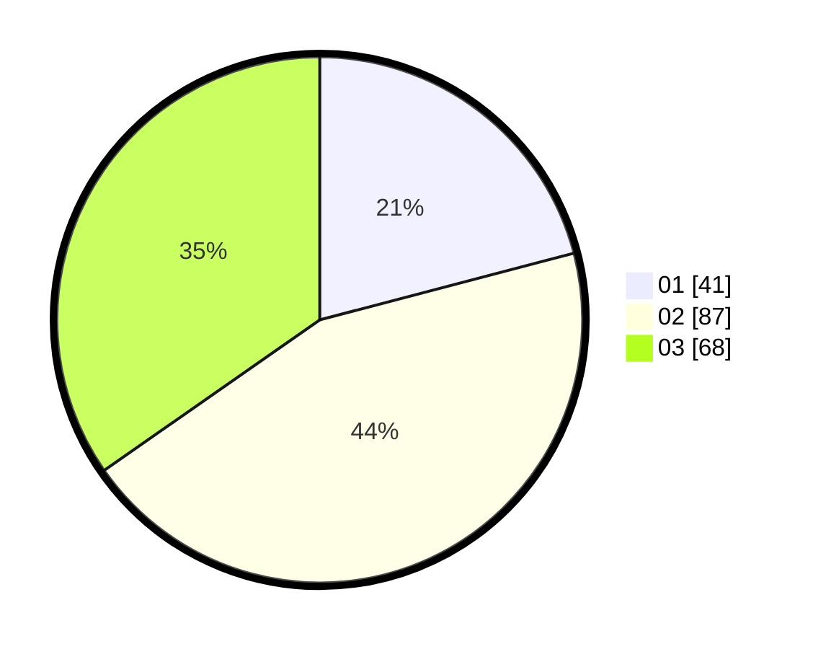

# Hasil

Hasil perolehan suara paslon dapat dilihat pada file paslon-01.txt, paslon-02.txt, dan paslon-03.txt.

Jika tidak ada, artinya data tersebut belum ada pada SIREKAP.

## Perolehan Suara

 * Paslon 01: **41**.
 * Paslon 02: **87**.
 * Paslon 03: **68**.

## Foto C Plano

https://sirekap-obj-formc.kpu.go.id/9d32/pemilu/ppwp/31/71/06/10/01/3171061001045-20240214-194419--7b617d85-15c7-4237-b9c0-991a307c52f0.jpg

https://sirekap-obj-formc.kpu.go.id/9d32/pemilu/ppwp/31/71/06/10/01/3171061001045-20240214-230704--50384425-e817-4273-a1a7-b6c9cd0a8571.jpg

https://sirekap-obj-formc.kpu.go.id/9d32/pemilu/ppwp/31/71/06/10/01/3171061001045-20240214-230617--a2e84fcf-5c62-4efa-a770-51a6c577342b.jpg

## DATA PEMILIH TETAP

Jumlah pemilih dalam DPT: **246**.
 * L: **102**.
 * P: **144**.

## DATA PENGGUNA HAK PILIH

Jumlah pengguna hak pilih dalam DPT: **170**.
 * L: **72**.
 * P: **98**.

Jumlah pengguna hak pilih dalam DPTb: **19**.
 * L: **5**.
 * P: **14**.

Jumlah pengguna hak pilih dalam DPK: **9**.
 * L: **5**.
 * P: **4**.

Jumlah pengguna hak pilih: **198**.
 * L: **82**.
 * P: **116**.

## JUMLAH SUARA SAH DAN TIDAK SAH

JUMLAH SELURUH SUARA SAH: **196**.

JUMLAH SUARA TIDAK SAH: **2**.

JUMLAH SELURUH SUARA SAH DAN SUARA TIDAK SAH: **198**.
