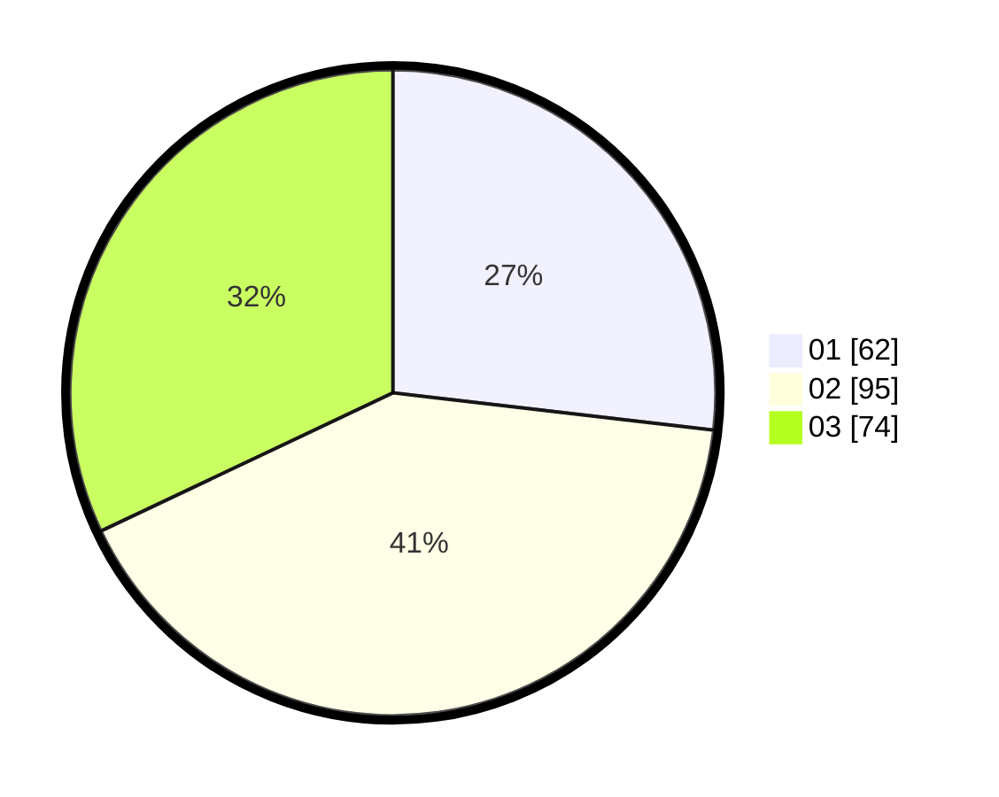

# Hasil

Hasil perolehan suara paslon dapat dilihat pada file paslon-01.txt, paslon-02.txt, dan paslon-03.txt.

Jika tidak ada, artinya data tersebut belum ada pada SIREKAP.

## Perolehan Suara

 * Paslon 01: **62**.
 * Paslon 02: **95**.
 * Paslon 03: **74**.

## Foto C Plano

https://sirekap-obj-formc.kpu.go.id/78dd/pemilu/ppwp/31/71/06/10/01/3171061001047-20240216-161701--713940ee-3d4e-4aae-b245-8e6986e1f74a.jpg

https://sirekap-obj-formc.kpu.go.id/78dd/pemilu/ppwp/31/71/06/10/01/3171061001047-20240216-161702--8a7b4077-5f9a-4c8b-b754-173913f078c9.jpg

https://sirekap-obj-formc.kpu.go.id/78dd/pemilu/ppwp/31/71/06/10/01/3171061001047-20240216-161702--acc95540-0fb1-47f6-ba0a-d017144eac15.jpg

## DATA PEMILIH TETAP

Jumlah pemilih dalam DPT: **280**.
 * L: **121**.
 * P: **159**.

## DATA PENGGUNA HAK PILIH

Jumlah pengguna hak pilih dalam DPT: **206**.
 * L: **85**.
 * P: **121**.

Jumlah pengguna hak pilih dalam DPTb: **25**.
 * L: **13**.
 * P: **12**.

Jumlah pengguna hak pilih dalam DPK: **3**.
 * L: **3**.
 * P: **0**.

Jumlah pengguna hak pilih: **234**.
 * L: **101**.
 * P: **133**.

## JUMLAH SUARA SAH DAN TIDAK SAH

JUMLAH SELURUH SUARA SAH: **231**.

JUMLAH SUARA TIDAK SAH: **3**.

JUMLAH SELURUH SUARA SAH DAN SUARA TIDAK SAH: **234**.
