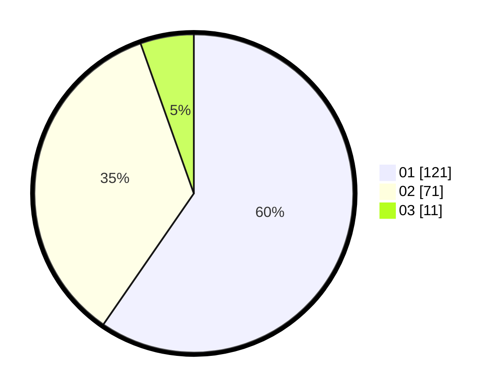

# Hasil

Hasil perolehan suara paslon dapat dilihat pada file paslon-01.txt, paslon-02.txt, dan paslon-03.txt.

Jika tidak ada, artinya data tersebut belum ada pada SIREKAP.

## Perolehan Suara

 * Paslon 01: **121**.
 * Paslon 02: **71**.
 * Paslon 03: **11**.

## Foto C Plano

https://sirekap-obj-formc.kpu.go.id/0c24/pemilu/ppwp/31/71/06/10/01/3171061001056-20240214-234900--3147d189-cd52-4783-9e88-dfcaed19d375.jpg

https://sirekap-obj-formc.kpu.go.id/0c24/pemilu/ppwp/31/71/06/10/01/3171061001056-20240215-165844--ea12e6c2-0b17-4f1d-82f1-539eff5ed5dc.jpg

https://sirekap-obj-formc.kpu.go.id/0c24/pemilu/ppwp/31/71/06/10/01/3171061001056-20240215-170415--77041786-6024-46b2-b7e3-10d0cd5eb71f.jpg

## DATA PEMILIH TETAP

Jumlah pemilih dalam DPT: **248**.
 * L: **138**.
 * P: **110**.

## DATA PENGGUNA HAK PILIH

Jumlah pengguna hak pilih dalam DPT: **208**.
 * L: **115**.
 * P: **93**.

Jumlah pengguna hak pilih dalam DPTb: **0**.
 * L: **0**.
 * P: **0**.

Jumlah pengguna hak pilih dalam DPK: **0**.
 * L: **0**.
 * P: **0**.

Jumlah pengguna hak pilih: **208**.
 * L: **115**.
 * P: **93**.

## JUMLAH SUARA SAH DAN TIDAK SAH

JUMLAH SELURUH SUARA SAH: **203**.

JUMLAH SUARA TIDAK SAH: **5**.

JUMLAH SELURUH SUARA SAH DAN SUARA TIDAK SAH: **208**.
