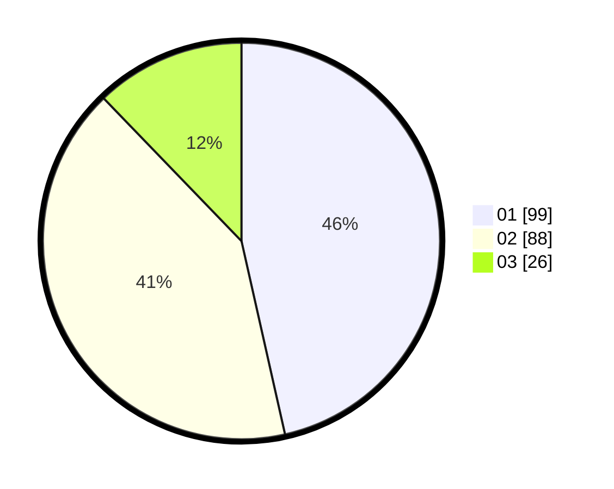

# Hasil

Hasil perolehan suara paslon dapat dilihat pada file paslon-01.txt, paslon-02.txt, dan paslon-03.txt.

Jika tidak ada, artinya data tersebut belum ada pada SIREKAP.

## Perolehan Suara

 * Paslon 01: **99**.
 * Paslon 02: **88**.
 * Paslon 03: **26**.

## Foto C Plano

https://sirekap-obj-formc.kpu.go.id/3240/pemilu/ppwp/31/71/06/10/01/3171061001060-20240217-082134--3d951583-6cc6-4e1a-939f-0b194cfce83f.jpg

https://sirekap-obj-formc.kpu.go.id/3240/pemilu/ppwp/31/71/06/10/01/3171061001060-20240217-082136--43c7ac3f-ee97-4268-8410-4f91c28b04c0.jpg

https://sirekap-obj-formc.kpu.go.id/3240/pemilu/ppwp/31/71/06/10/01/3171061001060-20240217-082135--cf7b483b-1028-4ca1-a9b1-2c61ebb525de.jpg

## DATA PEMILIH TETAP

Jumlah pemilih dalam DPT: **262**.
 * L: **129**.
 * P: **133**.

## DATA PENGGUNA HAK PILIH

Jumlah pengguna hak pilih dalam DPT: **215**.
 * L: **103**.
 * P: **112**.

Jumlah pengguna hak pilih dalam DPTb: **0**.
 * L: **0**.
 * P: **0**.

Jumlah pengguna hak pilih dalam DPK: **0**.
 * L: **0**.
 * P: **0**.

Jumlah pengguna hak pilih: **215**.
 * L: **103**.
 * P: **112**.

## JUMLAH SUARA SAH DAN TIDAK SAH

JUMLAH SELURUH SUARA SAH: **213**.

JUMLAH SUARA TIDAK SAH: **2**.

JUMLAH SELURUH SUARA SAH DAN SUARA TIDAK SAH: **215**.
