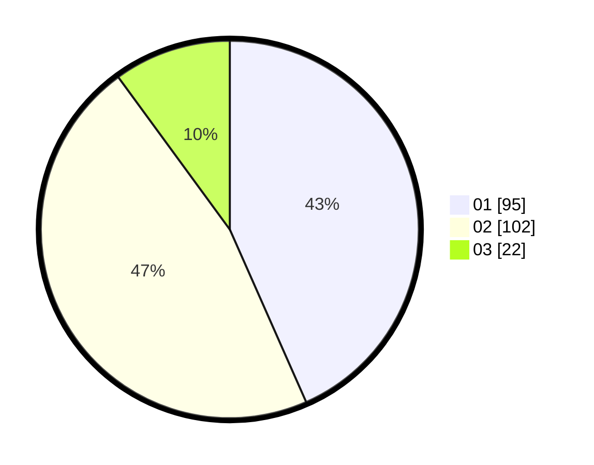

# Hasil

Hasil perolehan suara paslon dapat dilihat pada file paslon-01.txt, paslon-02.txt, dan paslon-03.txt.

Jika tidak ada, artinya data tersebut belum ada pada SIREKAP.

## Perolehan Suara

 * Paslon 01: **95**.
 * Paslon 02: **102**.
 * Paslon 03: **22**.

## Foto C Plano

https://sirekap-obj-formc.kpu.go.id/801b/pemilu/ppwp/31/71/06/10/01/3171061001063-20240216-153921--4ea1dccb-ae3a-4543-a484-7deeae11d7aa.jpg

https://sirekap-obj-formc.kpu.go.id/801b/pemilu/ppwp/31/71/06/10/01/3171061001063-20240214-210449--e6504907-c9b0-44b7-b91d-e8b781c5939b.jpg

https://sirekap-obj-formc.kpu.go.id/801b/pemilu/ppwp/31/71/06/10/01/3171061001063-20240214-190342--a1f12dfd-d6ed-4b59-b99b-9246e0a68945.jpg
