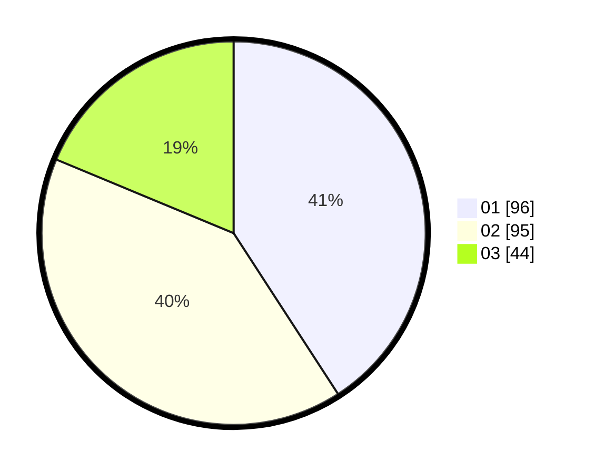

# Hasil

Hasil perolehan suara paslon dapat dilihat pada file paslon-01.txt, paslon-02.txt, dan paslon-03.txt.

Jika tidak ada, artinya data tersebut belum ada pada SIREKAP.

## Perolehan Suara

 * Paslon 01: **96**.
 * Paslon 02: **95**.
 * Paslon 03: **44**.

## Foto C Plano

https://sirekap-obj-formc.kpu.go.id/3bb0/pemilu/ppwp/31/71/06/10/01/3171061001064-20240214-155055--f8512758-07ef-4398-8895-89b7fb9dcd48.jpg

https://sirekap-obj-formc.kpu.go.id/3bb0/pemilu/ppwp/31/71/06/10/01/3171061001064-20240214-155229--8e8ac866-d85c-4f5f-b3cf-e8af3f485e94.jpg

https://sirekap-obj-formc.kpu.go.id/3bb0/pemilu/ppwp/31/71/06/10/01/3171061001064-20240214-155312--933a222f-eb96-4296-ad01-474a35092402.jpg

## DATA PEMILIH TETAP

Jumlah pemilih dalam DPT: **275**.
 * L: **145**.
 * P: **230**.

## DATA PENGGUNA HAK PILIH

Jumlah pengguna hak pilih dalam DPT: **220**.
 * L: **108**.
 * P: **112**.

Jumlah pengguna hak pilih dalam DPTb: **17**.
 * L: **9**.
 * P: **8**.

Jumlah pengguna hak pilih dalam DPK: **5**.
 * L: **3**.
 * P: **2**.

Jumlah pengguna hak pilih: **240**.
 * L: **120**.
 * P: **120**.

## JUMLAH SUARA SAH DAN TIDAK SAH

JUMLAH SELURUH SUARA SAH: **235**.

JUMLAH SUARA TIDAK SAH: **5**.

JUMLAH SELURUH SUARA SAH DAN SUARA TIDAK SAH: **240**.
