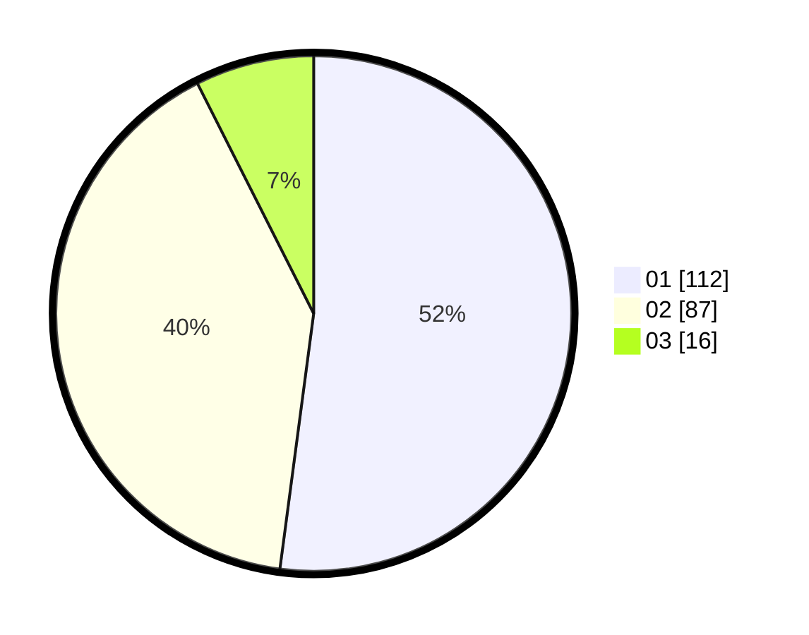

# Hasil

Hasil perolehan suara paslon dapat dilihat pada file paslon-01.txt, paslon-02.txt, dan paslon-03.txt.

Jika tidak ada, artinya data tersebut belum ada pada SIREKAP.

## Perolehan Suara

 * Paslon 01: **112**.
 * Paslon 02: **87**.
 * Paslon 03: **16**.

## Foto C Plano

https://sirekap-obj-formc.kpu.go.id/9f95/pemilu/ppwp/31/71/06/10/01/3171061001071-20240214-193437--7f32e406-6e8e-4c16-9a5f-8e8e7e16847f.jpg

https://sirekap-obj-formc.kpu.go.id/9f95/pemilu/ppwp/31/71/06/10/01/3171061001071-20240214-195458--cc12f708-1e56-45f8-9d1b-f7c0c35669e3.jpg

https://sirekap-obj-formc.kpu.go.id/9f95/pemilu/ppwp/31/71/06/10/01/3171061001071-20240214-195336--46115583-e2ed-4323-989a-d4b88b5e75bd.jpg
