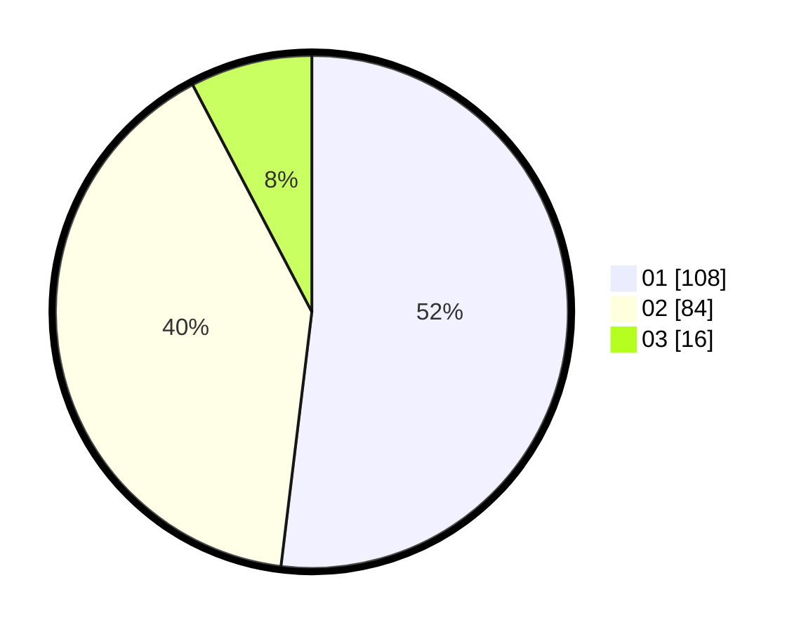

# Hasil

Hasil perolehan suara paslon dapat dilihat pada file paslon-01.txt, paslon-02.txt, dan paslon-03.txt.

Jika tidak ada, artinya data tersebut belum ada pada SIREKAP.

## Perolehan Suara

 * Paslon 01: **108**.
 * Paslon 02: **84**.
 * Paslon 03: **16**.

## Foto C Plano

https://sirekap-obj-formc.kpu.go.id/be64/pemilu/ppwp/31/71/06/10/01/3171061001077-20240216-172350--b8923dfc-5df5-41c8-b000-8bc7efd72138.jpg

https://sirekap-obj-formc.kpu.go.id/be64/pemilu/ppwp/31/71/06/10/01/3171061001077-20240216-172351--aa186423-117c-4af9-95fd-fd349d328495.jpg

https://sirekap-obj-formc.kpu.go.id/be64/pemilu/ppwp/31/71/06/10/01/3171061001077-20240216-172351--ce2300fa-80ee-4d6e-9559-07d64fabadde.jpg

## DATA PEMILIH TETAP

Jumlah pemilih dalam DPT: **276**.
 * L: **119**.
 * P: **157**.

## DATA PENGGUNA HAK PILIH

Jumlah pengguna hak pilih dalam DPT: **207**.
 * L: **87**.
 * P: **120**.

Jumlah pengguna hak pilih dalam DPTb: **3**.
 * L: **2**.
 * P: **1**.

Jumlah pengguna hak pilih dalam DPK: **2**.
 * L: **2**.
 * P: **0**.

Jumlah pengguna hak pilih: **212**.
 * L: **91**.
 * P: **121**.

## JUMLAH SUARA SAH DAN TIDAK SAH

JUMLAH SELURUH SUARA SAH: **208**.

JUMLAH SUARA TIDAK SAH: **4**.

JUMLAH SELURUH SUARA SAH DAN SUARA TIDAK SAH: **212**.
