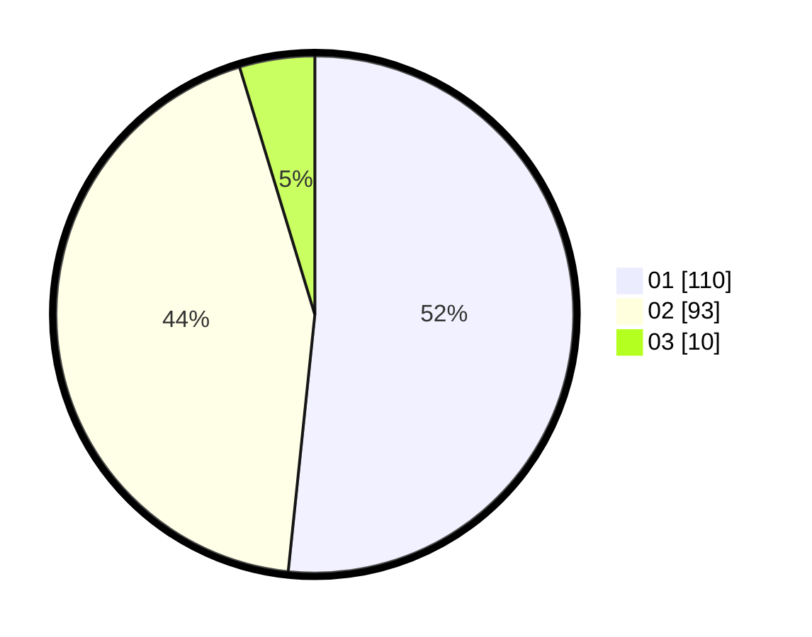

# Hasil

Hasil perolehan suara paslon dapat dilihat pada file paslon-01.txt, paslon-02.txt, dan paslon-03.txt.

Jika tidak ada, artinya data tersebut belum ada pada SIREKAP.

## Perolehan Suara

 * Paslon 01: **110**.
 * Paslon 02: **93**.
 * Paslon 03: **10**.

## Foto C Plano

https://sirekap-obj-formc.kpu.go.id/cd2c/pemilu/ppwp/31/71/06/10/01/3171061001079-20240215-002120--23fad9dc-e785-4a8a-b8ae-d7739b44ecb0.jpg

https://sirekap-obj-formc.kpu.go.id/cd2c/pemilu/ppwp/31/71/06/10/01/3171061001079-20240215-002226--34adca58-43fc-4b3b-8deb-81bd54a7e614.jpg

https://sirekap-obj-formc.kpu.go.id/cd2c/pemilu/ppwp/31/71/06/10/01/3171061001079-20240215-002346--45706798-ff32-4e8c-939a-07ed33cd8cf6.jpg

## DATA PEMILIH TETAP

Jumlah pemilih dalam DPT: **217**.
 * L: **115**.
 * P: **102**.

## DATA PENGGUNA HAK PILIH

Jumlah pengguna hak pilih dalam DPT: **216**.
 * L: **114**.
 * P: **102**.

Jumlah pengguna hak pilih dalam DPTb: **1**.
 * L: **1**.
 * P: **0**.

Jumlah pengguna hak pilih dalam DPK: **0**.
 * L: **0**.
 * P: **0**.

Jumlah pengguna hak pilih: **217**.
 * L: **115**.
 * P: **102**.

## JUMLAH SUARA SAH DAN TIDAK SAH

JUMLAH SELURUH SUARA SAH: **213**.

JUMLAH SUARA TIDAK SAH: **4**.

JUMLAH SELURUH SUARA SAH DAN SUARA TIDAK SAH: **217**.
