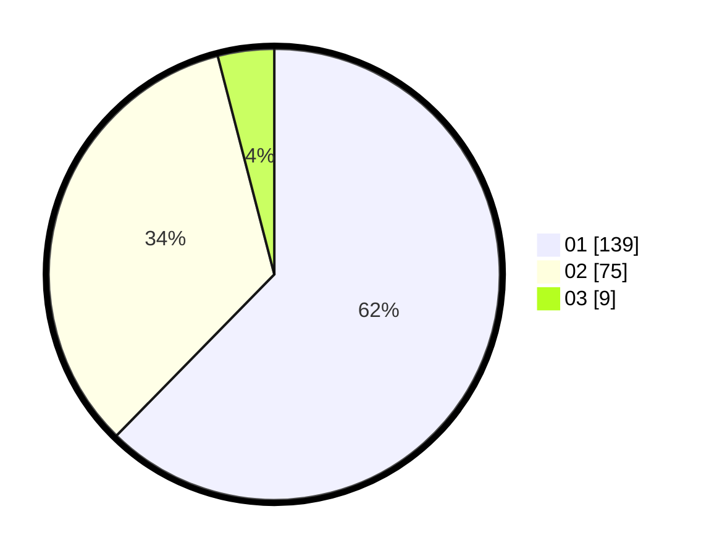

# Hasil

Hasil perolehan suara paslon dapat dilihat pada file paslon-01.txt, paslon-02.txt, dan paslon-03.txt.

Jika tidak ada, artinya data tersebut belum ada pada SIREKAP.

## Perolehan Suara

 * Paslon 01: **139**.
 * Paslon 02: **75**.
 * Paslon 03: **9**.

## Foto C Plano

https://sirekap-obj-formc.kpu.go.id/9c4a/pemilu/ppwp/31/71/06/10/01/3171061001084-20240214-155347--67bc3bf3-2041-42a5-bc9d-98813dabd4a6.jpg

https://sirekap-obj-formc.kpu.go.id/9c4a/pemilu/ppwp/31/71/06/10/01/3171061001084-20240214-214426--3928ce1f-3c52-4379-b3dd-db712ac986a0.jpg

https://sirekap-obj-formc.kpu.go.id/9c4a/pemilu/ppwp/31/71/06/10/01/3171061001084-20240214-155342--ffa21e28-2c99-4147-a438-d6c64bca7664.jpg

## DATA PEMILIH TETAP

Jumlah pemilih dalam DPT: **284**.
 * L: **140**.
 * P: **144**.

## DATA PENGGUNA HAK PILIH

Jumlah pengguna hak pilih dalam DPT: **215**.
 * L: **101**.
 * P: **114**.

Jumlah pengguna hak pilih dalam DPTb: **10**.
 * L: **4**.
 * P: **6**.

Jumlah pengguna hak pilih dalam DPK: **2**.
 * L: **2**.
 * P: **0**.

Jumlah pengguna hak pilih: **227**.
 * L: **107**.
 * P: **120**.

## JUMLAH SUARA SAH DAN TIDAK SAH

JUMLAH SELURUH SUARA SAH: **223**.

JUMLAH SUARA TIDAK SAH: **4**.

JUMLAH SELURUH SUARA SAH DAN SUARA TIDAK SAH: **227**.
