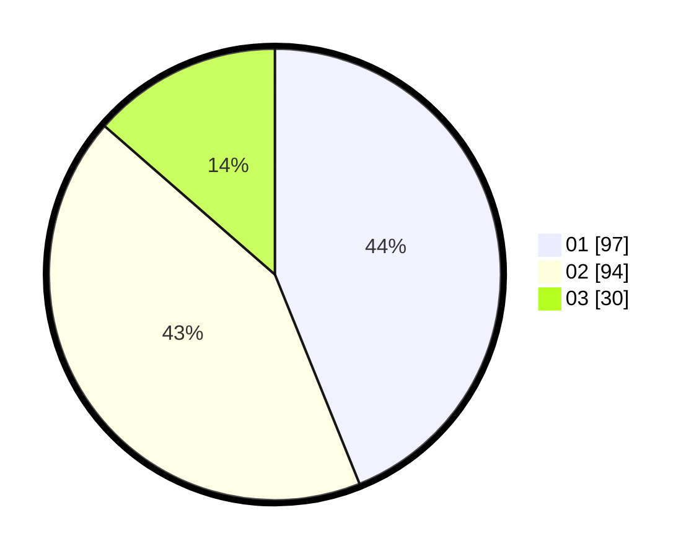

# Hasil

Hasil perolehan suara paslon dapat dilihat pada file paslon-01.txt, paslon-02.txt, dan paslon-03.txt.

Jika tidak ada, artinya data tersebut belum ada pada SIREKAP.

## Perolehan Suara

 * Paslon 01: **97**.
 * Paslon 02: **94**.
 * Paslon 03: **30**.

## Foto C Plano

https://sirekap-obj-formc.kpu.go.id/30b3/pemilu/ppwp/31/71/06/10/02/3171061002004-20240217-233517--5c7c0b68-efaa-4ee9-b8f9-a7d2a244eaa5.jpg

https://sirekap-obj-formc.kpu.go.id/30b3/pemilu/ppwp/31/71/06/10/02/3171061002004-20240217-234429--63c2a6ba-7543-4c20-918d-a872cd259f1c.jpg

https://sirekap-obj-formc.kpu.go.id/30b3/pemilu/ppwp/31/71/06/10/02/3171061002004-20240217-235058--ab3e08a2-b4e5-45e3-972d-ddf605167752.jpg

## DATA PEMILIH TETAP

Jumlah pemilih dalam DPT: **276**.
 * L: **130**.
 * P: **146**.

## DATA PENGGUNA HAK PILIH

Jumlah pengguna hak pilih dalam DPT: **220**.
 * L: **98**.
 * P: **122**.

Jumlah pengguna hak pilih dalam DPTb: **2**.
 * L: **2**.
 * P: **0**.

Jumlah pengguna hak pilih dalam DPK: **1**.
 * L: **1**.
 * P: **0**.

Jumlah pengguna hak pilih: **223**.
 * L: **101**.
 * P: **122**.

## JUMLAH SUARA SAH DAN TIDAK SAH

JUMLAH SELURUH SUARA SAH: **221**.

JUMLAH SUARA TIDAK SAH: **2**.

JUMLAH SELURUH SUARA SAH DAN SUARA TIDAK SAH: **223**.
