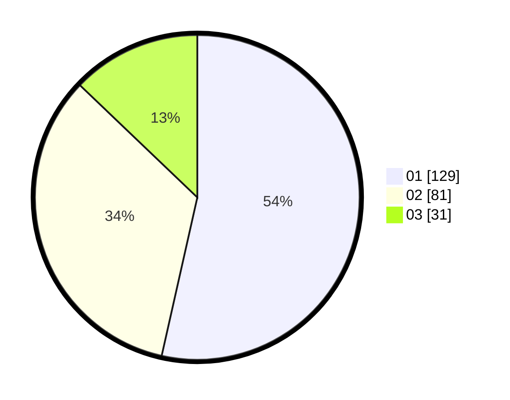

# Hasil

Hasil perolehan suara paslon dapat dilihat pada file paslon-01.txt, paslon-02.txt, dan paslon-03.txt.

Jika tidak ada, artinya data tersebut belum ada pada SIREKAP.

## Perolehan Suara

 * Paslon 01: **129**.
 * Paslon 02: **81**.
 * Paslon 03: **31**.

## Foto C Plano

https://sirekap-obj-formc.kpu.go.id/d4b8/pemilu/ppwp/31/71/06/10/02/3171061002014-20240218-185055--a0bc6c05-bccc-4a55-9c5f-370dbc42b989.jpg

https://sirekap-obj-formc.kpu.go.id/d4b8/pemilu/ppwp/31/71/06/10/02/3171061002014-20240214-221402--f24254c4-9bd0-41ee-81a3-2efa2e5a05b6.jpg

https://sirekap-obj-formc.kpu.go.id/d4b8/pemilu/ppwp/31/71/06/10/02/3171061002014-20240214-221453--2f3ce027-3293-4284-a78c-926b06995a8e.jpg

## DATA PEMILIH TETAP

Jumlah pemilih dalam DPT: **292**.
 * L: **139**.
 * P: **153**.

## DATA PENGGUNA HAK PILIH

Jumlah pengguna hak pilih dalam DPT: **228**.
 * L: **98**.
 * P: **130**.

Jumlah pengguna hak pilih dalam DPTb: **13**.
 * L: **6**.
 * P: **7**.

Jumlah pengguna hak pilih dalam DPK: **3**.
 * L: **1**.
 * P: **2**.

Jumlah pengguna hak pilih: **244**.
 * L: **105**.
 * P: **139**.

## JUMLAH SUARA SAH DAN TIDAK SAH

JUMLAH SELURUH SUARA SAH: **241**.

JUMLAH SUARA TIDAK SAH: **3**.

JUMLAH SELURUH SUARA SAH DAN SUARA TIDAK SAH: **244**.
