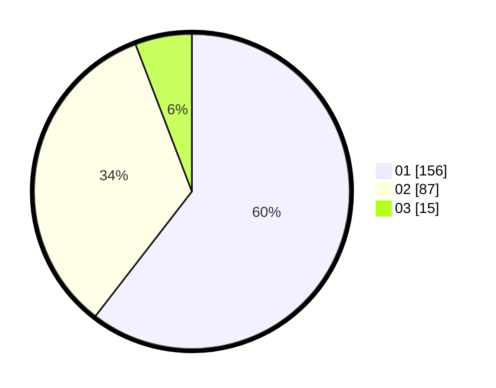

# Hasil

Hasil perolehan suara paslon dapat dilihat pada file paslon-01.txt, paslon-02.txt, dan paslon-03.txt.

Jika tidak ada, artinya data tersebut belum ada pada SIREKAP.

## Perolehan Suara

 * Paslon 01: **156**.
 * Paslon 02: **87**.
 * Paslon 03: **15**.

## Foto C Plano

https://sirekap-obj-formc.kpu.go.id/6a8a/pemilu/ppwp/31/71/06/10/02/3171061002016-20240214-194611--e1e9797e-17ce-475f-b4f7-a3267a925bca.jpg

https://sirekap-obj-formc.kpu.go.id/6a8a/pemilu/ppwp/31/71/06/10/02/3171061002016-20240214-234453--d1cf1125-3615-4a07-9a83-fa065a18685b.jpg

https://sirekap-obj-formc.kpu.go.id/6a8a/pemilu/ppwp/31/71/06/10/02/3171061002016-20240214-234651--43d49f3f-2c0d-4557-bbcb-321102e46131.jpg

## DATA PEMILIH TETAP

Jumlah pemilih dalam DPT: **289**.
 * L: **139**.
 * P: **150**.

## DATA PENGGUNA HAK PILIH

Jumlah pengguna hak pilih dalam DPT: **247**.
 * L: **119**.
 * P: **128**.

Jumlah pengguna hak pilih dalam DPTb: **15**.
 * L: **4**.
 * P: **11**.

Jumlah pengguna hak pilih dalam DPK: **1**.
 * L: **0**.
 * P: **1**.

Jumlah pengguna hak pilih: **263**.
 * L: **123**.
 * P: **140**.

## JUMLAH SUARA SAH DAN TIDAK SAH

JUMLAH SELURUH SUARA SAH: **258**.

JUMLAH SUARA TIDAK SAH: **5**.

JUMLAH SELURUH SUARA SAH DAN SUARA TIDAK SAH: **263**.
