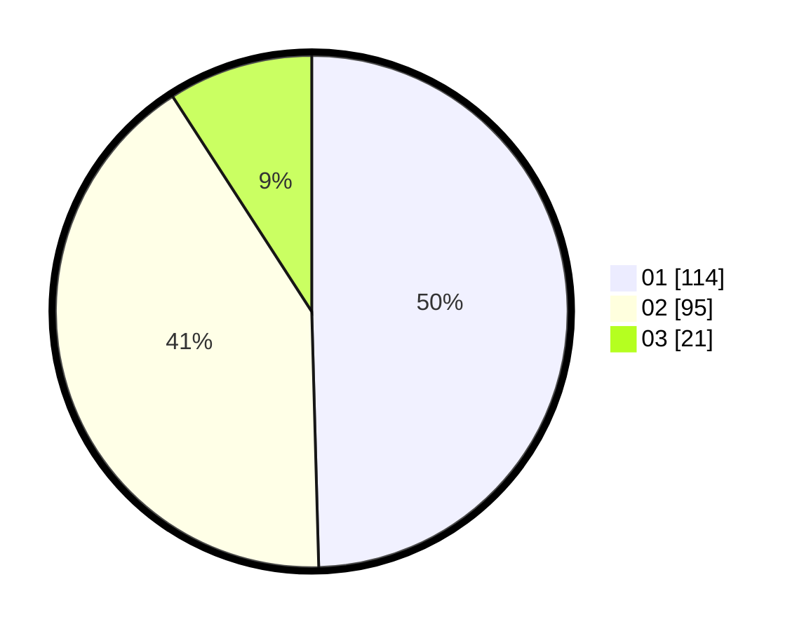

# Hasil

Hasil perolehan suara paslon dapat dilihat pada file paslon-01.txt, paslon-02.txt, dan paslon-03.txt.

Jika tidak ada, artinya data tersebut belum ada pada SIREKAP.

## Perolehan Suara

 * Paslon 01: **114**.
 * Paslon 02: **95**.
 * Paslon 03: **21**.

## Foto C Plano

https://sirekap-obj-formc.kpu.go.id/df26/pemilu/ppwp/31/71/06/10/02/3171061002021-20240214-215819--2fef6387-e6aa-4d4c-88ca-1f328e9a3eaf.jpg

https://sirekap-obj-formc.kpu.go.id/df26/pemilu/ppwp/31/71/06/10/02/3171061002021-20240214-214444--3cb4f120-9596-408c-b84c-9c11f838ac09.jpg

https://sirekap-obj-formc.kpu.go.id/df26/pemilu/ppwp/31/71/06/10/02/3171061002021-20240214-215958--6308bf1e-193a-4ed8-aa6b-fb83815448b7.jpg

## DATA PEMILIH TETAP

Jumlah pemilih dalam DPT: **290**.
 * L: **146**.
 * P: **144**.

## DATA PENGGUNA HAK PILIH

Jumlah pengguna hak pilih dalam DPT: **222**.
 * L: **113**.
 * P: **109**.

Jumlah pengguna hak pilih dalam DPTb: **6**.
 * L: **5**.
 * P: **1**.

Jumlah pengguna hak pilih dalam DPK: **7**.
 * L: **3**.
 * P: **4**.

Jumlah pengguna hak pilih: **235**.
 * L: **121**.
 * P: **114**.

## JUMLAH SUARA SAH DAN TIDAK SAH

JUMLAH SELURUH SUARA SAH: **230**.

JUMLAH SUARA TIDAK SAH: **5**.

JUMLAH SELURUH SUARA SAH DAN SUARA TIDAK SAH: **235**.
