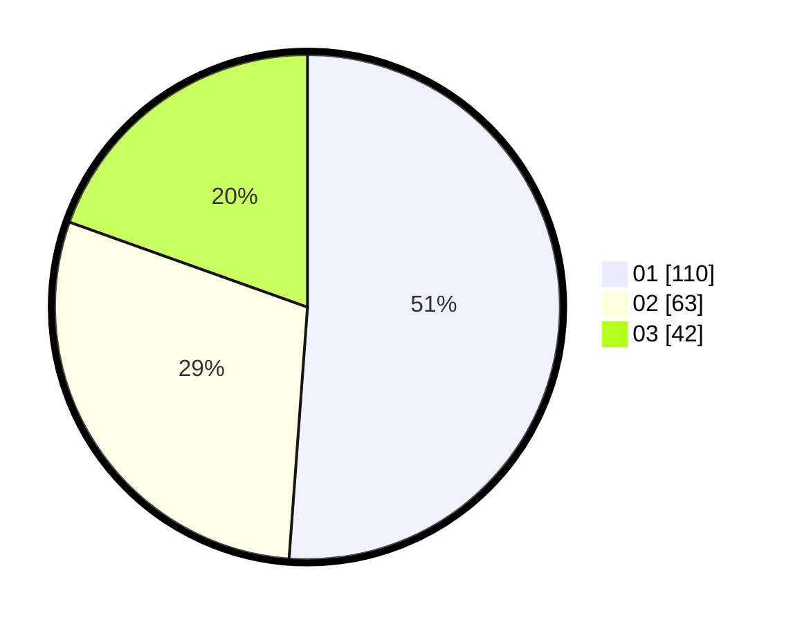

# Hasil

Hasil perolehan suara paslon dapat dilihat pada file paslon-01.txt, paslon-02.txt, dan paslon-03.txt.

Jika tidak ada, artinya data tersebut belum ada pada SIREKAP.

## Perolehan Suara

 * Paslon 01: **110**.
 * Paslon 02: **63**.
 * Paslon 03: **42**.

## Foto C Plano

https://sirekap-obj-formc.kpu.go.id/c3a6/pemilu/ppwp/31/71/06/10/02/3171061002023-20240214-194726--b1ba586c-759f-4fb0-8e36-9f4a896f0ce5.jpg

https://sirekap-obj-formc.kpu.go.id/c3a6/pemilu/ppwp/31/71/06/10/02/3171061002023-20240214-194824--1b8dfd7d-6e30-4254-afed-87380b54fead.jpg

https://sirekap-obj-formc.kpu.go.id/c3a6/pemilu/ppwp/31/71/06/10/02/3171061002023-20240214-194901--cc1d8d9b-0b6a-4a15-9858-a4a2b572abc8.jpg

## DATA PEMILIH TETAP

Jumlah pemilih dalam DPT: **257**.
 * L: **177**.
 * P: **155**.

## DATA PENGGUNA HAK PILIH

Jumlah pengguna hak pilih dalam DPT: **209**.
 * L: **99**.
 * P: **110**.

Jumlah pengguna hak pilih dalam DPTb: **3**.
 * L: **0**.
 * P: **3**.

Jumlah pengguna hak pilih dalam DPK: **6**.
 * L: **1**.
 * P: **5**.

Jumlah pengguna hak pilih: **218**.
 * L: **100**.
 * P: **118**.

## JUMLAH SUARA SAH DAN TIDAK SAH

JUMLAH SELURUH SUARA SAH: **215**.

JUMLAH SUARA TIDAK SAH: **11**.

JUMLAH SELURUH SUARA SAH DAN SUARA TIDAK SAH: **226**.
